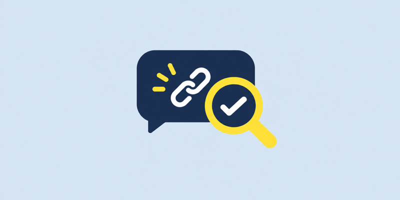
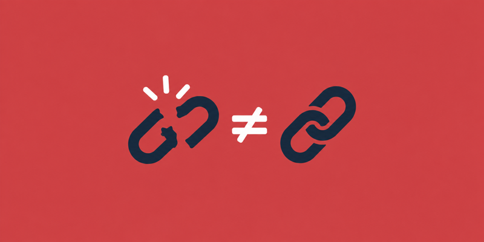

# 카카오 결과 카드 네이티브 프로토타입

- 작성일: 2026-09-18
- 상태: **개발 채널 자체 검증 완료, 사용자 테스트 미실행**
- 3안 비교: `docs/designs/ux-options-3.md`
- 제작 방법: `docs/designs/kakao-chatbot-build-guide.md`

PR #7 멘토 피드백의 FE UI/UX 비교 요청을 실제 카카오 화면에서 확인하기 위해 만든
개발 채널 전용 프로토타입이다. 사용자 이해도와 안전 오해 여부는 검증하지 않았으므로
최종 UX 선택이 아니다.

## 선택한 구조

3안 중 **챗봇 완결형**을 바탕으로 첫 카드에는 결과와 안전 한계를 요약하고,
추가 근거는 `자세히 보기` 캐러셀로 분리했다.

```text
한 장 요약 결과 카드
+
선택형 자세히 보기 캐러셀
```

이 구조는 사용자가 추가 버튼을 누르지 않아도 핵심 안내를 볼 수 있고, 현재 범위의 정보는
별도 상세 웹 없이 카카오 기본 카드와 캐러셀로 표현할 수 있다는 가설을 확인하기 위한 것이다.

## 개발 채널 구성

개발 채널 `클릭 전 확인`의 `시나리오 02`에 다음 블록을 만들었다.

- `PROTOTYPE_카드 테스트`
- `PROTOTYPE_R1_공식 주소와 다름`
- `PROTOTYPE_R2_다른 점 못 찾음`
- `PROTOTYPE_R3_정보 부족`
- `PROTOTYPE_자세히 보기`

테스트 입력:

| 입력 | 표시 결과 |
| --- | --- |
| `카드 테스트` | 프로토타입 진입 카드 |
| `결과1 테스트` | 공식 주소와 다름 |
| `결과2 테스트` | 다른 점을 못 찾음 |
| `결과3 테스트` | 확인할 정보가 부족함 |

## 사용자 화면 문구

| 내부 상태 | 사용자 제목 | 버튼 |
| --- | --- | --- |
| R1 위험 징후 | `공식 주소와 달라요` | `신고·상담 받기` `자세히 보기` |
| R2 이상 징후 미발견 | `다른 점을 못 찾았어요` | `공식 앱 열기` `자세히 보기` |
| R3 판단 보류 | `확인할 정보가 부족해요` | `다시 보내기` `자세히 보기` |

보고서 말투도 일상적인 표현으로 바꿨다.

| 기존 | 프로토타입 |
| --- | --- |
| 주소 1건 | 주소 1개 |
| 발신자 | 보낸 사람 |
| 공식 주소 목록 | 공식 홈페이지 주소 |
| 근거 보기 | 자세히 보기 |

`다른 점을 못 찾았어요`에는 `안전하다는 뜻은 아니에요`를 첫 카드와 캐러셀에 모두 표시한다.

## 자세히 보기 캐러셀

`자세히 보기`는 다음 3장으로 연결된다.

1. 확인한 것 — 문자 속 주소를 공식 홈페이지 주소와 비교한 결과
2. 확인 못 한 것 — 페이지 내용·보낸 사람 등 확인하지 못한 범위와 안전 보증이 아니라는 안내
3. 지금 할 일 — 문자 속 링크 대신 공식 앱에서 직접 확인하라는 안내

## 자체 확인 결과

스마트폰 카카오톡 개발 채널에서 다음을 확인했다.

- 800×400 이미지 표시
- 제목·본문 표시
- 가로 버튼 2개 배치
- `자세히 보기` 버튼에서 3장 캐러셀 연결
- 캐러셀 좌우 이동
- `확인한 것 → 확인 못 한 것 → 지금 할 일` 순서

이는 렌더링과 연결 동작에 대한 자체 확인이며 사용자 대상 사용성 테스트가 아니다.

## 프로토타입 이미지

카드에 올린 800×400 이미지다. 동적 문구·브랜드·URL은 넣지 않고 상태만 나타낸다.
원본은 `kakao-templates/assets/prototype/`에 있다.

### 진입 카드



### 공식 주소와 다름



### 다른 점을 못 찾음


### 확인할 정보가 부족함


## 알려진 한계

- 사용자 대상 테스트를 진행하지 않았다.
- R4 처리 실패, R5 분석 중, R6 주소 없음 카드를 만들지 않았다.
- `신고·상담 받기`, `공식 앱 열기`, `다시 보내기`는 실제 기능과 연결하지 않았다.
- 외부 API 전송 동의와 urlscan.io 연동은 포함하지 않는다.
- 운영 채널에는 배포하지 않았다.

후속 사용자 테스트에서는 기대 행동 일치 수, 안전하다고 오해한 횟수,
캐러셀을 끝까지 본 비율을 기록한다.
