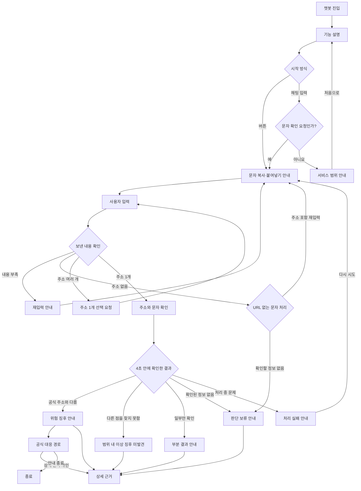

# 스미싱 의심 문자 접수 UX와 FE–BE 상호작용

- 작성일: 2026-09-16
- 상태: **검토 요청(Draft)**
- 목적: 구현 전에 사용자 흐름과 파트별 역할을 합의한다.

이 문서의 화면 상태와 데이터 이름은 제안이다. 실제 API와 스키마는 파트 간 합의 후 확정한다.

## 1. 범위와 원칙

이 문서는 카카오톡 채널에서 택배 사칭 의심 문자를 접수하고 결과를 안내하는 과정을 다룬다. 실제 화면, 템플릿, API, 판정 로직은 구현하지 않는다.

- 최종 판정은 백엔드가 정해진 규칙으로 수행한다. AI가 위험 여부를 결정하지 않는다.
- AI는 문자 해석, URL 추출 보조, 결과 설명만 담당한다.
- **관측**은 백엔드가 주소와 응답에서 직접 확인한 정보다. 관측이 없으면 해석하지 않고 판단을 보류한다.
- “이상 징후 미발견”은 확인한 범위에서 문제를 찾지 못했다는 뜻이며, 안전하다는 보장이 아니다.
- 의심 URL은 누를 수 있는 링크, 미리보기, 이미지로 보여주지 않는다.
- 사용자가 문자를 보내면 4초 안에 확인된 내용으로 답한다. 일부만 확인했다면 부분 결과를, 아무것도 확인하지 못했다면 판단 보류를 안내한다.
- AI가 설명을 만들지 못하면 백엔드가 준비한 기본 문장을 사용한다.

근거는 `docs/latency-budget.md`, `docs/security-checklist.md`, `frontend/README.md`와 각 모듈 README를 따른다.

## 2. 사용자 흐름



### 흐름 설명

1. 사용자는 버튼을 누르거나 채팅으로 문자 확인을 요청한다.
2. 챗봇은 의심 문자를 복사해 붙여넣는 방법을 안내한다.
3. 백엔드는 내용과 URL 개수를 확인한다. 입력이 부족하면 다시 요청한다.
4. URL이 하나면 백엔드가 주소를 확인하고 공식 주소 목록과 비교한다.
5. 4초 안에 확인한 정보에 따라 결과, 부분 결과, 판단 보류 또는 처리 실패를 안내한다.
6. 사용자는 상세 근거를 볼 수 있다. 위험 징후가 있으면 공식 대응 경로도 제공한다.

4초 이후에도 분석을 계속해 나중에 결과를 전달할지는 아직 정하지 않았다.

## 3. 상태별 안내

| 상태 | 사용자에게 보여줄 내용 | 다음 행동 |
| --- | --- | --- |
| 처음·입력 대기 | 서비스 설명과 문자 붙여넣기 방법 | 문자 전송 |
| 다른 대화 | 이 챗봇이 확인할 수 있는 범위 | 처음으로 |
| 입력 부족·URL 없음 | 문자 전체 또는 주소가 있는 부분 요청 | 다시 입력 |
| URL 여러 개 | 확인할 주소 하나를 요청 | 주소 선택 |
| 분석 중 | 주소를 누르지 말고 기다리도록 안내 | 기다리기 |
| 위험 징후 | 공식 주소와 다른 점, 확인한 내용, 미확인 내용 | 공식 경로·상세 보기 |
| 범위 내 미발견 | 확인한 내용과 미확인 내용을 함께 표시 | 상세 보기 |
| 부분 결과 | 확인된 항목과 확인하지 못한 항목 | 상세 보기 |
| 판단 보류 | 확인하지 못한 이유. AI 해석은 표시하지 않음 | 공식 경로·상세 보기 |
| 처리 실패 | 지금은 확인을 마치지 못했음을 안내 | 다시 시도 |
| 상세 링크 무효 | 이전 결과를 보여주지 않고 다시 확인하도록 안내 | 챗봇으로 돌아가기 |

카카오 결과 카드는 `결과 → 확인한 내용 → 확인하지 못한 내용 → 다음 행동` 순서로 보여준다. 한 문장에 한 행동만 안내하고 버튼은 1~2개로 제한한다.

## 4. 파트별 역할

| 담당 | 하는 일 |
| --- | --- |
| FE: 카카오톡 | 카드·말풍선 문구, 버튼, 상태별 화면 구성을 `kakao-templates/`에 정의 |
| FE: 상세 웹 | 상세 링크 확인, 결과 화면, 의심 URL 가리기, 잘못된 출력 차단, 상태별 테스트 |
| BE | 카카오 요청 수신, 입력 확인, URL 관측, 공식 주소 대조, 최종 판정, 4초 제한과 실패 처리 |
| BE 응답 변환 | 판정 결과에 맞는 템플릿을 골라 값을 채우고 카카오 응답 JSON으로 변환 |
| AI | 문자 해석, URL 추출 보조, 결과 설명. 최종 판정에는 관여하지 않음 |
| 협의 필요 | 자연어로 시작한 요청을 카카오 블록, 백엔드 규칙, AI 중 어디서 구분할지 결정 |

FE는 위험 여부를 다시 판단하지 않는다. BE가 준 결과를 사용자가 이해할 수 있는 카카오 메시지와 상세 화면으로 표현한다.

## 5. 카카오톡과 백엔드의 상호작용

백엔드가 아래와 같은 파이썬 딕셔너리를 반환하면 웹 프레임워크가 JSON으로 바꾸고, 카카오톡이 일반 텍스트 말풍선으로 보여준다.

```python
def kakao_response(text: str):
    return {
        "version": "2.0",
        "template": {
            "outputs": [{"simpleText": {"text": text}}]
        }
    }
```

`simpleText`는 버튼이 없는 짧은 안내에 적합하다. 시작 카드와 결과 카드는 버튼을 지원하는 카드 형식이 필요하다. FE가 문구와 버튼을 정의하고, BE는 결과값만 채운다.

```text
사용자 입력
→ 카카오톡이 백엔드 호출
→ 백엔드가 주소를 확인하고 결과 결정
→ 필요하면 AI가 설명 작성
→ 백엔드가 FE 템플릿에 결과값 입력
→ 카카오톡이 말풍선·카드로 표시
→ 사용자가 자세히 보기를 누르면 FE 상세 웹이 BE에서 결과 조회
```

FE가 상세 화면을 만들려면 BE로부터 결과 상태, 요약, 확인한 내용, 확인하지 못한 내용, 관측 시각·출처, 다음 행동, 상세 진입 토큰이 필요하다. 실제 필드명은 후속 협의에서 정한다.

## 6. 검토가 필요한 결정

1. 4초 안에 결과가 없을 때 판단 보류로 끝낼지, 나중에 결과를 다시 전달할지?
2. URL 없는 문자는 다시 입력만 요청할지, 문자 내용도 제한적으로 확인할지?
3. 부분 결과, 판단 보류, 처리 실패를 백엔드가 어떤 상태로 구분해 줄지?
4. “이 문자 확인해줘” 같은 채팅을 어디서 문자 확인 요청으로 구분할지?
5. FE가 사용할 결과 데이터 형식을 어디에서 함께 관리할지?

위 결정을 합의한 뒤 카카오 템플릿, FE 목 데이터·출력 차단, 상세 화면과 통합 테스트를 구현한다.
