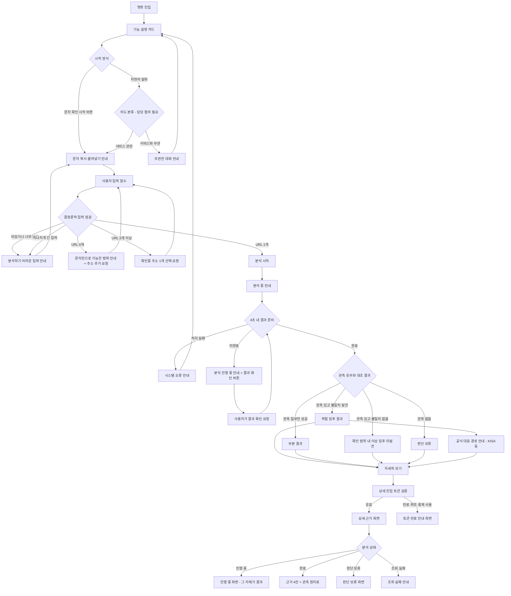
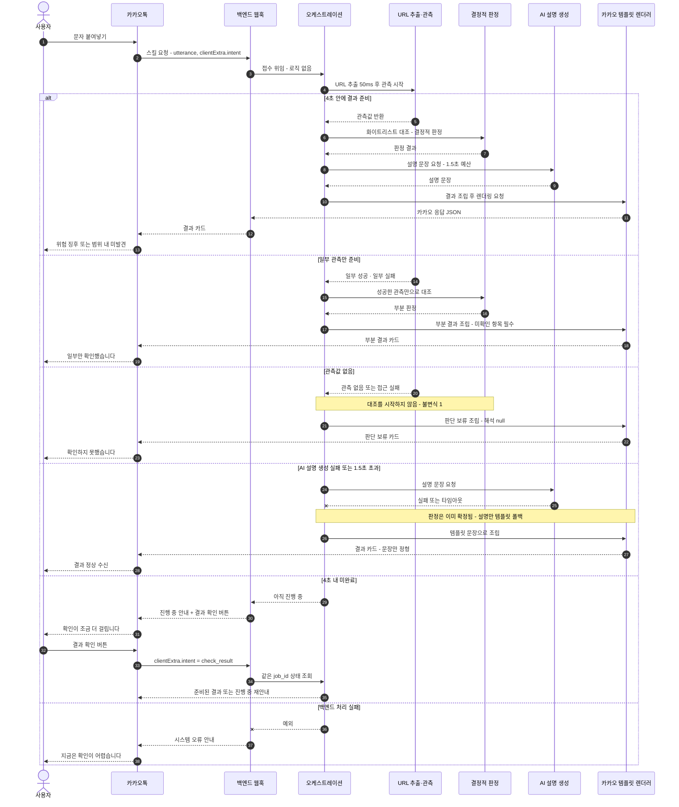
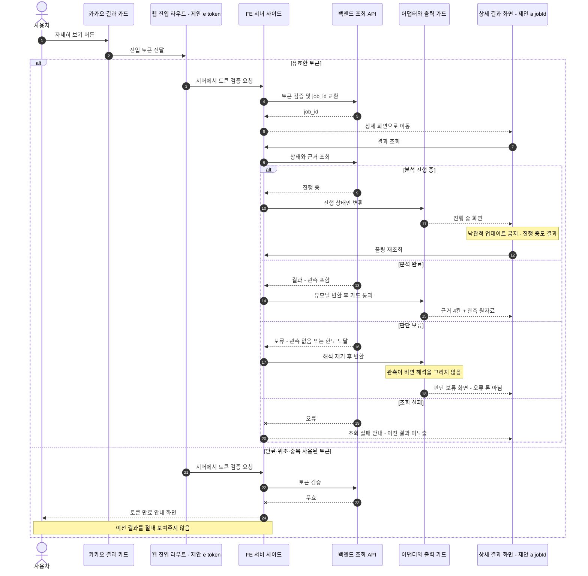

# 스미싱 의심 문자 접수 UX와 FE–BE 상호작용 설계 (검토용)

- 작성일: 2026-09-16
- 상태: **검토 요청 (Draft)** — 합의되지 않음
- 대상 독자: FE / BE / AI 파트, PM
- 근거 문서: `CLAUDE.md`, `docs/PRD.md`, `docs/latency-budget.md`, `docs/security-checklist.md`,
  `docs/contracts.md`, `docs/adr/0001-ai-as-local-package.md`,
  `frontend/**/README.md`, `kakao-templates/README.md`, `backend/src/server/**/README.md`,
  `ai/**/README.md`

## 표기 규칙

이 문서의 모든 항목은 아래 세 가지 중 하나로 표시합니다.

| 표기 | 의미 |
| --- | --- |
| **[확인됨]** | 저장소 문서에 이미 적혀 있는 원칙. 이 문서가 새로 정한 것이 아님 |
| **[제안]** | 이 문서에서 처음 제안하는 내용. 합의 전이며 확정된 계약이 아님 |
| **[협의 필요]** | 문서 간 충돌이 있거나 담당·정책이 정해지지 않은 항목. `9. 열린 질문`에 기록 |

> 이 문서에 등장하는 상태 이름, 화면 문구, API 경로, 데이터 항목 이름은 **전부 가칭**입니다.
> 실제 enum 값이나 필드명으로 옮기기 전에 `contracts/schemas`와 `ai/src/ai/types.py` 소유자의 합의가 필요합니다.
>
> 예시에 등장하는 주소는 모두 `(가려진 주소 A)` 같은 자리표시자입니다.
> 실제 스미싱 문자·URL은 이 문서에 **없으며**, 넣지 않습니다 (`frontend/mocks/README.md` 규칙).

---

## 1. 문서 목적과 비목표

### 1.1 목적

스미싱(택배 사칭) 의심 문자를 챗봇으로 접수해서 결과를 돌려주기까지의 **사용자 흐름·상태 모델·예외 처리·FE–BE 책임 경계**를 구현 전에 검토받는 것입니다.

구체적으로 다음 네 가지에 대한 피드백을 받는 것이 이 문서의 산출 목표입니다.

1. 카카오톡 말풍선과 상세 웹 사이의 정보 분리가 적절한가
2. 4초 안에 끝나지 않는 분석을 사용자에게 어떻게 표현할 것인가
3. 부분 결과 / 판단 보류 / 시간 초과 / 시스템 오류를 각각 구분해서 보여줄 필요가 있는가
4. FE가 BE에 요청해야 할 최소 데이터가 무엇인가

### 1.2 비목표 (이번 작업에서 하지 않는 것)

- 실제 화면 구현, 컴포넌트 작성, 라우트 추가
- API 경로·요청/응답 스키마 확정, `contracts/schemas` 수정
- `kakao-templates/` 템플릿 선언 추가·수정
- 판정 로직, 화이트리스트, 관측 도구 구현
- 문구(copy) 최종 확정 — 이 문서의 문구는 **검토를 위한 예시**입니다

이번 변경 파일은 `docs/designs/smishing-message-intake-ux.md`와 `docs/README.md` 두 개뿐입니다.

### 1.3 이 문서가 전제로 삼는 확정 원칙 [확인됨]

| 원칙 | 출처 |
| --- | --- |
| 판정은 결정적 로직이 한다. 공식 도메인 화이트리스트 대조가 판정의 근거다. LLM에게 "이 링크 위험해?"라고 묻지 않는다 | `CLAUDE.md` |
| LLM의 역할은 두 가지 — 난독화된 문자에서 URL 추출, 판정 결과를 사람이 읽을 문장으로 변환 | `CLAUDE.md` |
| LLM이 실패해도 응답은 나간다. 타임아웃 시 템플릿 문장으로 폴백한다 | `CLAUDE.md`, `docs/latency-budget.md` |
| 전체 데드라인 4.0초 (카카오 SLA 5초 − 안전 마진 1초). 각 단계는 예산 초과 시 거기까지의 결과로 응답을 만든다 | `docs/latency-budget.md` |
| 관측이 비어 있으면 대조를 시작하지 않고 즉시 판단 보류를 반환한다. 해석은 null | `backend/src/server/orchestration/README.md`, `ai/src/ai/pipeline/README.md` |
| 판정 값에 `safe`는 없다. enum에 추가하지 않는다 | `frontend/README.md`, `backend/src/server/models/README.md` |
| 근거 카드는 네 칸 — 문자 주장 / 관측 / 해석 / 미확인. 미확인 칸이 비면 렌더링하지 않고 오류 처리 | `frontend/src/components/README.md`, `backend/src/server/templates/README.md` |
| 의심 URL을 링크·미리보기·썸네일·og:image로 노출하지 않는다 | `frontend/README.md` |
| 판단 보류를 오류 톤으로 그리지 않는다 | `frontend/src/components/README.md` |
| 상세 웹은 읽기 전용이며 분석을 시작하지 않는다. 낙관적 업데이트 금지 | `frontend/README.md`, `frontend/src/app/README.md` |
| 토큰이 만료·중복 사용·위조면 이전 결과를 보여주지 않고 전용 안내 화면으로 끝낸다 | `frontend/src/app/README.md` |
| 카카오 문구·버튼 구성은 `kakao-templates/`(FE 소유) 소관, 렌더링만 `backend/src/server/templates/` | `kakao-templates/README.md`, `backend/src/server/templates/README.md` |
| 동의/고지 로직은 어디에도 두지 않는다 (PM 결정) | `frontend/README.md`, `backend/README.md`, `backend/src/server/models/README.md` |
| 의심 URL에 GET 금지 (HEAD만), 리다이렉트 최대 3홉·홉당 1초 | `docs/security-checklist.md`, `docs/latency-budget.md` |
| 문자 본문은 공격자가 쓴 텍스트다. 지시로 해석되지 않게 분리한다 | `docs/security-checklist.md` |

---

## 2. 사용자 흐름



### 흐름에서 의도적으로 넣은 것 [제안]

- **URL이 0개여도 흐름이 끊기지 않습니다.** "잘못된 입력"이 아니라 "지금 확인할 수 있는 범위"를 알리고 주소 추가를 요청하는 분기로 둡니다.
  다만 `ai/src/ai/pipeline/README.md`와 `backend/src/server/orchestration/README.md`(B03)는 URL이 0개 또는 2개 이상이면 "입력을 다시 요청한다"고만 적혀 있어, **사용자에게 어떤 톤으로 보일지는 [협의 필요]**입니다.
- **4초 미완료와 시스템 오류를 다른 분기로 둡니다.** 전자는 "아직 확인 중", 후자는 "확인하지 못했음"입니다.
- **모든 결과 상태에서 `자세히 보기`로 갈 수 있게 둡니다.** 판단 보류와 부분 결과도 상세 화면이 있어야 사용자가 "왜 결론이 없는지"를 볼 수 있습니다.

---

## 3. 상태별 UX

상태 이름은 전부 **[제안]**이며 실제 enum으로 확정하지 않습니다.
저장소에는 이미 `jobs.status`(`running` → `observed` → `done`/`held`, `backend/src/server/queue/README.md`)와
`evidence_cards.verdict`(`backend/src/server/models/README.md`)가 따로 존재합니다.
**화면 상태를 이 둘 중 무엇으로부터 유도할지는 [협의 필요]**입니다 (열린 질문 Q7).

### 3.1 최초 진입 — 제안 이름 `intro`

| 항목 | 내용 |
| --- | --- |
| 진입 조건 | 사용자가 채널에 처음 들어오거나 대화를 새로 시작 |
| 사용자에게 보여줄 문구 | "받은 문자가 사칭인지 확인해 드립니다. 문자를 그대로 붙여넣어 주세요." |
| 확인된 내용 | 없음 (아직 입력 없음) |
| 확인하지 못한 내용 | 전부 |
| 버튼과 다음 행동 | `문자 확인 시작` → `awaiting_input` |
| BE에서 필요한 정보 | 없음. 정적 템플릿으로 충분 [제안] |

### 3.2 입력 대기 — 제안 이름 `awaiting_input`

| 항목 | 내용 |
| --- | --- |
| 진입 조건 | `문자 확인 시작` 버튼 또는 서비스 관련 자연어 발화 |
| 사용자에게 보여줄 문구 | "받은 문자를 길게 눌러 복사한 뒤, 여기에 붙여넣어 주세요." (한 문장 = 한 행동) |
| 확인된 내용 | 없음 |
| 확인하지 못한 내용 | 전부 |
| 버튼과 다음 행동 | 버튼 없이 입력 대기. 보조 버튼 `복사하는 방법` 1개만 [제안] |
| BE에서 필요한 정보 | 세션이 이미 `분석 중`인지 여부 — 중복 접수 방지 (`chatbot_sessions`, orchestration 불변식 4) [확인됨] |

### 3.3 무관한 대화 — 제안 이름 `out_of_scope`

| 항목 | 내용 |
| --- | --- |
| 진입 조건 | 문자 접수와 무관한 발화 (인사, 잡담, 다른 문의) |
| 사용자에게 보여줄 문구 | "이 채널은 사칭 의심 문자를 확인해 드리는 곳입니다. 확인할 문자를 붙여넣어 주세요." |
| 확인된 내용 | 없음 |
| 확인하지 못한 내용 | 전부. **분석을 시작하지 않았음을 분명히 함** |
| 버튼과 다음 행동 | `문자 확인 시작` 1개 → `awaiting_input` |
| BE에서 필요한 정보 | 의도 분류 결과 [협의 필요] — 카카오 블록 분기 / BE 결정론 규칙 / AI 분류 중 어디인지 미정 (Q6) |

> 주의: `backend/src/server/api/README.md`는 `intent`를 **`action.clientExtra`에서만** 읽고 `utterance` 텍스트로 분기하지 않는다고 못박고 있습니다 [확인됨].
> 따라서 "자연어로 분석 시작"은 **카카오 블록의 발화 학습으로 처리되고 BE에는 `clientExtra.intent`로 도착한다**는 것이 가장 안전한 해석입니다 [제안].

### 3.4 분석하기 어려운 입력 — 제안 이름 `input_insufficient`

| 항목 | 내용 |
| --- | --- |
| 진입 조건 | 빈 입력, 너무 짧은 입력, 길이 상한 초과 |
| 사용자에게 보여줄 문구 | "문자 내용이 짧아 확인이 어렵습니다. 받은 문자 전체를 붙여넣어 주세요." |
| 확인된 내용 | 없음 |
| 확인하지 못한 내용 | 전부 |
| 버튼과 다음 행동 | `다시 붙여넣기` 1개 → `awaiting_input` |
| BE에서 필요한 정보 | 최소·최대 길이 기준값 [협의 필요] — 저장소에 기준 없음. 상수는 `ai/src/ai/config/`의 설정 관리 원칙을 따라야 함 |

### 3.5 분석 중 — 제안 이름 `analyzing`

| 항목 | 내용 |
| --- | --- |
| 진입 조건 | 분석 대상이 확정되어 파이프라인이 시작됨 |
| 사용자에게 보여줄 문구 | "문자에 적힌 주소를 확인하고 있습니다. 잠시만 기다려 주세요." |
| 확인된 내용 | 접수 사실, 분석 대상 주소가 1개로 확정됐다는 사실 |
| 확인하지 못한 내용 | 관측 결과 일체. **이 상태에서 어떤 해석도 보여주지 않음** [확인됨] |
| 버튼과 다음 행동 | 4초 내 완료 시 결과로 자동 전환. 미완료 시 `결과 확인` 버튼 1개 노출 [제안] |
| BE에서 필요한 정보 | 진행 상태, `job_id`, 재확인 가능 시점 [제안] |

> **가장 큰 미결정 지점**: 4초 안에 안 끝난 분석을 어떻게 이어붙일지입니다.
> `backend/src/server/api/README.md`·`queue/README.md`는 `useCallback: true` + 콜백(최대 1분)을 전제로 하고,
> `CLAUDE.md`는 "카카오 콜백은 제한된 임시 기능이라 의존하지 않는다"고 적혀 있습니다.
> 이 문서는 **더 엄격한 쪽(콜백이 오지 않아도 성립하는 흐름)** 을 기준으로 그렸습니다: 콜백은 보조 수단이고,
> 사용자의 `결과 확인` 재요청(`check_result`)이 정상 경로입니다 [제안]. 확정은 [협의 필요] (Q4).

### 3.6 위험 징후 관측 — 제안 이름 `signals_observed`

| 항목 | 내용 |
| --- | --- |
| 진입 조건 | 관측값이 있고, 결정론적 대조에서 공식 도메인과의 불일치가 확인됨 |
| 사용자에게 보여줄 문구 | "문자에 적힌 주소가 공식 주소와 달랐습니다. 누르지 마세요." |
| 확인된 내용 | 문자가 주장하는 발신처, 실제 관측된 주소·응답, 관측 시각, 공식 목록과의 불일치 |
| 확인하지 못한 내용 | 페이지 내부에서 실제로 무엇을 요구하는지, 발신 번호의 실사용자 등 미관측 항목 |
| 버튼과 다음 행동 | `공식 확인 경로`(KISA 등) 1개 + `자세히 보기` 1개 [제안] |
| BE에서 필요한 정보 | 결과 상태, 4칸 근거, 관측 시각·출처, 권장 행동, 공식 대응 경로, 상세 진입 토큰 |

### 3.7 확인 범위 내 이상 징후 미발견 — 제안 이름 `no_signals_in_scope`

| 항목 | 내용 |
| --- | --- |
| 진입 조건 | 관측값이 있고, 확인한 범위 안에서는 불일치가 발견되지 않음 |
| 사용자에게 보여줄 문구 | "확인한 범위 안에서는 이상한 점을 찾지 못했습니다. 안전하다는 뜻은 아닙니다." |
| 확인된 내용 | 확인한 항목과 그 결과, 관측 시각 |
| 확인하지 못한 내용 | **반드시 함께 표시.** 확인하지 못한 항목이 비어 있으면 카드를 그리지 않고 오류 처리 [확인됨] |
| 버튼과 다음 행동 | `자세히 보기` 1개. 필요 시 `공식 경로로 직접 확인` [제안] |
| BE에서 필요한 정보 | 확인한 항목 목록, 확인하지 못한 항목 목록, 관측 시각·출처 |

> `frontend/mocks/README.md`의 `result-no-signals.json` 설명 그대로 — **"안전"이 아니라 "범위 내 미발견"** 입니다 [확인됨].

### 3.8 부분 결과 — 제안 이름 `partial`

| 항목 | 내용 |
| --- | --- |
| 진입 조건 | 일부 관측만 성공하고 나머지는 예산 초과·실패 |
| 사용자에게 보여줄 문구 | "일부만 확인했습니다. 아직 결론을 내리기에는 부족합니다." |
| 확인된 내용 | 성공한 관측만 |
| 확인하지 못한 내용 | 실패·중단된 관측 항목과 그 이유 |
| 버튼과 다음 행동 | `자세히 보기` 1개. 재조회 제공 여부는 조회 한도 정책에 달림 [협의 필요] |
| BE에서 필요한 정보 | 성공·실패 관측 구분, 실패 사유, 재조회 가능 여부 |

> 부분 결과와 판단 보류를 하나로 합칠지는 [협의 필요] (Q5).
> 이 문서는 **"관측이 하나라도 있으면 부분 결과, 하나도 없으면 판단 보류"** 를 제안합니다 [제안].
> 근거: orchestration 불변식 1 — 관측이 비면 대조를 시작하지 않고 즉시 판단 보류 [확인됨].

### 3.9 판단 보류 — 제안 이름 `held`

| 항목 | 내용 |
| --- | --- |
| 진입 조건 | 관측값 없음 / 접근 실패 / 조회 한도 도달 |
| 사용자에게 보여줄 문구 | "이 주소는 확인하지 못했습니다. 확인될 때까지 누르지 마세요." |
| 확인된 내용 | 확인을 시도했다는 사실과 시도 시각 |
| 확인하지 못한 내용 | 관측 전부. **해석을 표시하지 않음** [확인됨] |
| 버튼과 다음 행동 | `공식 확인 경로` 1개 + `자세히 보기` 1개 [제안] |
| BE에서 필요한 정보 | 보류 사유(접근 실패 / 한도 도달 / 관측 없음), 시도 시각 |

> **오류 톤으로 그리지 않습니다** [확인됨]. 회색 경고처럼 보이면 사용자가 "그럼 직접 눌러보자"로 가고, 그 순간 제품이 무너집니다 (`frontend/src/components/README.md`).

### 3.10 분석 시간 초과 — 제안 이름 `timeout_pending`

| 항목 | 내용 |
| --- | --- |
| 진입 조건 | 4.0초 데드라인 안에 결과 조립이 끝나지 않음 |
| 사용자에게 보여줄 문구 | "확인이 조금 더 걸리고 있습니다. 잠시 뒤 아래 버튼을 눌러 주세요." |
| 확인된 내용 | 분석이 **진행 중**이라는 사실 |
| 확인하지 못한 내용 | 결과 전부 |
| 버튼과 다음 행동 | `결과 확인` 1개 → 같은 `job_id` 재조회 [제안] |
| BE에서 필요한 정보 | 진행 상태, `job_id`, 재확인 안내 시점 |

> 시간 초과는 **실패가 아닙니다.** `docs/latency-budget.md`의 "각 단계는 예산 초과 시 거기까지의 결과로 응답을 만든다"에 따라,
> 관측이 일부라도 있으면 `partial`로, 하나도 없으면 이 상태로 두는 것을 제안합니다 [제안].

### 3.11 시스템 오류 — 제안 이름 `system_error`

| 항목 | 내용 |
| --- | --- |
| 진입 조건 | BE 처리 실패, 파이프라인 예외, 렌더링 가드 발동 |
| 사용자에게 보여줄 문구 | "지금은 확인이 어렵습니다. 잠시 뒤 다시 시도해 주세요." |
| 확인된 내용 | 없음 |
| 확인하지 못한 내용 | 전부. **부분 결과를 흉내 내지 않음** |
| 버튼과 다음 행동 | `다시 시도` 1개 [제안] |
| BE에서 필요한 정보 | 실패 사실과 사용자에게 보여줄 수 있는 수준의 사유만. 스택·내부 오류 메시지는 노출하지 않음 [제안] |

> 시간 초과(`timeout_pending`)와 시스템 오류(`system_error`)를 같은 상태로 묶지 않습니다.
> 전자는 "기다리면 나옴", 후자는 "다시 해야 함"이라 사용자의 다음 행동이 다릅니다 [제안].
> AI 설명 생성 실패는 **여기에 해당하지 않습니다** — 템플릿 문장으로 폴백해 정상 결과를 내보냅니다 [확인됨].

### 3.12 상세 조회 토큰 만료 — 제안 이름 `entry_token_invalid`

| 항목 | 내용 |
| --- | --- |
| 진입 조건 | 상세 진입 토큰이 만료·위조·중복 사용 |
| 사용자에게 보여줄 문구 | "이 링크는 더 이상 열 수 없습니다. 챗봇에서 다시 확인해 주세요." |
| 확인된 내용 | 없음 |
| 확인하지 못한 내용 | 전부. **이전 결과를 절대 보여주지 않음** [확인됨] |
| 버튼과 다음 행동 | `챗봇으로 돌아가기` 1개 [제안] |
| BE에서 필요한 정보 | 토큰 무효 사실만. 무효 사유를 세분해서 노출할지는 [협의 필요] (정보 노출 관점) |

---

## 4. 주요 화면 구성

와이어프레임은 검토용 텍스트 스케치입니다. 실제 카드 타입(`simpleText` / `basicCard` / `itemCard` / `listCard` / `quickReplies`)
매핑은 `kakao-templates/`에서 선언하며 이 문서에서 확정하지 않습니다 [확인됨].

### 4.1 초기 기능 설명 카드

- 사용자 목적: 이 채널이 무엇을 해 주는 곳인지 5초 안에 이해
- 제목: 사칭 의심 문자 확인
- 핵심 설명: 받은 문자를 붙여넣으면 문자에 적힌 주소를 대신 확인해 드립니다
- 확인된 내용: 없음
- 미확인 내용: 없음 (아직 접수 전)
- 권장 행동: 문자를 복사해 붙여넣기
- 버튼: `문자 확인 시작` (1개)
- 고령 사용자·접근성: 한 문장에 한 행동만. 버튼 1개. 전문 용어(URL, 도메인, 피싱) 대신 "주소", "사칭" 사용. 텍스트만으로 의미가 완결되어 이미지·아이콘에 의존하지 않음
- 사용하면 안 되는 표현: "안전 검사", "악성 여부 판별", "100% 차단"

```
┌────────────────────────────┐
│ 사칭 의심 문자 확인          │
│                            │
│ 받은 문자를 붙여넣으면       │
│ 문자에 적힌 주소를           │
│ 대신 확인해 드립니다.        │
│                            │
│ [ 문자 확인 시작 ]           │
└────────────────────────────┘
```

### 4.2 문자 복사·붙여넣기 안내

- 사용자 목적: 복사 방법을 몰라 이탈하지 않게 하기
- 제목: 문자를 붙여넣어 주세요
- 핵심 설명: 문자 메시지를 길게 누르면 복사가 나옵니다
- 확인된 내용: 없음
- 미확인 내용: 없음
- 권장 행동: 복사한 문자를 이 대화창에 붙여넣기
- 버튼: `복사하는 방법` (1개, 선택)
- 고령 사용자·접근성: 단계를 한 줄에 하나씩, 번호로. "길게 누르기"처럼 동작 그대로 표기. 스크린리더에서 순서가 유지되도록 목록 구조 유지
- 사용하면 안 되는 표현: "클립보드", "텍스트 추출", "OCR"

```
┌────────────────────────────┐
│ 문자를 붙여넣어 주세요        │
│                            │
│ 1. 문자를 길게 누릅니다       │
│ 2. 복사를 누릅니다           │
│ 3. 여기에 붙여넣습니다        │
│                            │
│ [ 복사하는 방법 ]            │
└────────────────────────────┘
```

### 4.3 분석 중 안내

- 사용자 목적: 지금 무슨 일이 일어나는지 알고 기다리기
- 제목: 확인하고 있습니다
- 핵심 설명: 문자에 적힌 주소를 확인하는 중입니다
- 확인된 내용: 접수됨
- 미확인 내용: 결과 전부
- 권장 행동: 기다리기. 주소를 직접 누르지 않기
- 버튼: 없음 (4초 내 완료 시) / `결과 확인` 1개 (미완료 시)
- 고령 사용자·접근성: 진행률 퍼센트·스피너에 의존하지 않고 문장으로 상태 전달. 대기 중에도 "누르지 마세요"를 유지
- 사용하면 안 되는 표현: "검사 중이니 안심하세요", "곧 안전 여부를 알려드립니다"

```
┌────────────────────────────┐
│ 확인하고 있습니다            │
│                            │
│ 문자에 적힌 주소를           │
│ 확인하는 중입니다.           │
│ 아직 누르지 마세요.          │
│                            │
│ (4초 초과 시) [ 결과 확인 ]  │
└────────────────────────────┘
```

### 4.4 위험 징후 결과 카드

- 사용자 목적: 누르면 안 된다는 것과 그 이유를 즉시 이해
- 제목: 공식 주소와 달랐습니다
- 핵심 설명: 문자가 말한 곳과 실제 주소가 일치하지 않았습니다
- 확인된 내용: 문자 주장 / 관측된 주소 표기(클릭 불가) / 관측 시각 / 공식 목록 불일치
- 미확인 내용: 페이지 내부 요구 사항 등 확인하지 못한 항목 (항상 표시)
- 권장 행동: 누르지 마세요. 공식 확인 경로로 직접 확인하세요
- 버튼: `공식 확인 경로` + `자세히 보기` (최대 2개)
- 고령 사용자·접근성: 결론 문장을 맨 위에. 색상만으로 위험을 전달하지 않고 문장으로 명시. 주소는 **클릭 불가 텍스트**로만 (`MaskedUrl`) [확인됨]
- 사용하면 안 되는 표현: "악성 사이트 확정", "해킹당했습니다", 그리고 어떤 형태의 안전 보증도 금지

```
┌────────────────────────────┐
│ 공식 주소와 달랐습니다        │
│                            │
│ 문자 주장 : 택배 배송 안내    │
│ 확인한 것 : (가려진 주소 A)   │
│             2026-09-16 확인  │
│ 해석      : 공식 주소 목록과  │
│             일치하지 않음     │
│ 확인 못함 : 페이지 내부 내용  │
│                            │
│ 누르지 마세요.               │
│ [ 공식 확인 경로 ] [ 자세히 ] │
└────────────────────────────┘
```

### 4.5 확인 범위 내 이상 징후 미발견 결과 카드

- 사용자 목적: "괜찮다"로 오해하지 않으면서도 불필요한 공포를 갖지 않기
- 제목: 확인한 범위에서는 이상한 점을 찾지 못했습니다
- 핵심 설명: 확인한 항목 안에서는 불일치가 없었습니다
- 확인된 내용: 확인한 항목과 결과, 관측 시각
- 미확인 내용: 확인하지 못한 항목 (**비면 카드 자체를 그리지 않음**) [확인됨]
- 권장 행동: 그래도 문자로 온 주소는 누르지 말고 공식 경로로 확인하기
- 버튼: `자세히 보기` (1개)
- 고령 사용자·접근성: 제목에 "안전"이라는 단어가 들어가지 않게 함. 결론과 한계를 같은 화면에서 붙여 읽게 배치
- 사용하면 안 되는 표현: "안전합니다", "정상입니다", "문제없습니다", "안심하세요", "공식 사이트가 맞습니다"

```
┌────────────────────────────┐
│ 확인한 범위에서는            │
│ 이상한 점을 찾지 못했습니다   │
│                            │
│ 확인한 것 : 주소 표기, 연결   │
│             2026-09-16 확인  │
│ 확인 못함 : 페이지 내부 내용, │
│             발신 번호 실사용자 │
│                            │
│ 안전하다는 뜻은 아닙니다.     │
│ [ 자세히 보기 ]              │
└────────────────────────────┘
```

### 4.6 부분 결과 / 판단 보류 카드

- 사용자 목적: 결론이 없는 이유를 이해하고, 그래도 안전한 행동을 하기
- 제목: (부분 결과) 일부만 확인했습니다 / (판단 보류) 확인하지 못했습니다
- 핵심 설명: 확인된 것과 부족한 것을 나눠서 제시
- 확인된 내용: 성공한 관측만. 관측이 하나도 없으면 "시도했다는 사실"만
- 미확인 내용: 실패·중단 항목과 이유
- 권장 행동: 확인될 때까지 누르지 마세요
- 버튼: `공식 확인 경로` + `자세히 보기` (최대 2개)
- 고령 사용자·접근성: 실패를 사용자 탓으로 읽히지 않게 씀. 오류 색·경고 아이콘 사용 금지 [확인됨]
- 사용하면 안 되는 표현: "분석 실패", "오류가 발생했습니다", "알 수 없음" 같은 기계적 표현. 반대로 "아마 괜찮을 것 같습니다" 같은 추측도 금지

```
┌────────────────────────────┐
│ 확인하지 못했습니다          │
│                            │
│ 확인한 것 : 확인을 시도함     │
│             2026-09-16 시도  │
│ 부족한 것 : 주소 연결 확인    │
│ 결론      : 아직 판단할 수    │
│             없습니다          │
│                            │
│ 확인될 때까지 누르지 마세요.  │
│ [ 공식 확인 경로 ] [ 자세히 ] │
└────────────────────────────┘
```

### 4.7 시스템 오류 · 시간 초과 안내

두 화면을 **분리**합니다 [제안].

| | 시간 초과 | 시스템 오류 |
| --- | --- | --- |
| 사용자 목적 | 기다리면 된다는 것을 알기 | 지금은 안 된다는 것을 알기 |
| 제목 | 확인이 조금 더 걸립니다 | 지금은 확인이 어렵습니다 |
| 핵심 설명 | 아직 확인하는 중입니다 | 지금은 확인을 마치지 못했습니다 |
| 확인된 내용 | 분석이 진행 중이라는 사실 | 없음 |
| 미확인 내용 | 결과 전부 | 전부 |
| 권장 행동 | 잠시 뒤 결과 확인 | 잠시 뒤 다시 시도 |
| 버튼 | `결과 확인` (1개) | `다시 시도` (1개) |
| 금지 표현 | "실패했습니다" | "일시적 오류이니 안심하세요", 내부 오류 코드·스택 |

접근성 공통: 두 화면 모두 "주소를 누르지 마세요"를 유지합니다. 결과가 없다고 해서 경고가 사라지면 안 됩니다.

### 4.8 상세 근거 화면 (2차 웹)

- 사용자 목적: 왜 그런 결론인지 근거와 원자료를 확인
- 제목: 확인 결과 자세히 보기
- 핵심 설명: 근거 4칸 + 관측 원자료 목록
- 확인된 내용: 문자 주장 / 관측 / 해석 / 관측 시각·출처
- 미확인 내용: 미확인 칸 (항상 존재, 비면 오류) [확인됨]
- 권장 행동: 공식 확인 경로로 직접 확인
- 버튼: `공식 확인 경로` (1개). 필요 시 `챗봇으로 돌아가기`
- 고령 사용자·접근성: 본문 글자 크기 확대 여지, 충분한 대비, 표를 가로 스크롤 없이 세로로 쌓기. 의심 주소는 `MaskedUrl`로 클릭 불가 텍스트 [확인됨]
- 사용하면 안 되는 표현: 안전 보증 표현 일체, 관측 없는 해석, 원본 링크·미리보기·썸네일

```
확인 결과 자세히 보기
────────────────────────────
문자 주장   택배 배송 안내라고 함
관측        (가려진 주소 A) 연결 응답 확인
            출처: 격리 관측 / 2026-09-16 10:21
해석        공식 주소 목록과 일치하지 않음
확인 못함   페이지 내부 내용, 발신 번호 실사용자
────────────────────────────
관측 원자료
- 항목 / 결과 / 출처 / 관측 시각
- 항목 / 실패 / 출처 / 시도 시각
────────────────────────────
[ 공식 확인 경로 ]
```

> `observations`가 비면 `interpretation`을 받더라도 해석 칸을 그리지 않습니다 [확인됨] (`frontend/src/components/README.md`).
> 관측 원자료의 문자열은 전부 텍스트 노드로만 출력하며 `dangerouslySetInnerHTML`을 쓰지 않습니다 [확인됨].

### 4.9 토큰 만료 화면

- 사용자 목적: 왜 안 열리는지 알고 다음 행동을 알기
- 제목: 이 링크는 더 이상 열 수 없습니다
- 핵심 설명: 챗봇에서 다시 확인해 주세요
- 확인된 내용: 없음
- 미확인 내용: 전부
- 권장 행동: 챗봇으로 돌아가 다시 확인
- 버튼: `챗봇으로 돌아가기` (1개)
- 고령 사용자·접근성: 사용자 잘못으로 읽히지 않는 문장. 재시도 방법을 한 문장으로
- 사용하면 안 되는 표현: 이전 결과의 일부 노출, "만료되었지만 이전 결과는 아래와 같습니다" 류 [확인됨 — 금지]

---

## 5. 입력 유형별 처리

**URL이 없다는 이유만으로 잘못된 입력으로 처리하지 않습니다** [제안].
저장소는 URL 개수가 1이 아니면 "입력 재요청"이라고만 적고 있어(`ai/src/ai/pipeline/README.md`, B03), 톤과 표현은 [협의 필요]입니다.

| 입력 유형 | 접수 여부 | 분석 가능 범위 | 미확인 항목 | 안내 문구 (예시) | 다음 행동 |
| --- | --- | --- | --- | --- | --- |
| 서비스와 무관한 대화 | 접수하지 않음 | 없음 | 전부 | "이 채널은 사칭 의심 문자를 확인해 드리는 곳입니다." | `문자 확인 시작` |
| 비어 있거나 너무 짧은 입력 | 접수하지 않음 | 없음 | 전부 | "문자 내용이 짧아 확인이 어렵습니다. 받은 문자 전체를 붙여넣어 주세요." | 재입력 요청 |
| URL 없는 의심 문자 | **접수함** | 문자 본문 해석·유형 분류까지만 (AI-01/AI-02) | 주소 관측 전부, 대조 전부 | "문자에 주소가 보이지 않습니다. 주소가 있는 부분도 함께 붙여넣어 주세요." | 주소 추가 요청, 대상 미확정이면 판단 보류 |
| URL만 있는 입력 | **접수함** | 주소 관측·대조는 가능 | 문자가 무엇을 주장하는지(= 근거 4칸의 "문자 주장" 칸) | "주소만 확인합니다. 받은 문자 내용도 함께 주시면 더 정확히 확인할 수 있습니다." | 관측 진행 + 문자 본문 추가 요청 |
| 문자와 URL이 모두 있는 입력 | 접수함 | 전체 파이프라인 | 관측 실패 항목만 | (분석 중 안내로 진행) | 분석 시작 |
| URL이 여러 개인 입력 | 접수함 (분석 대상은 미확정) | 대상 확정 전까지 없음 | 관측 전부 | "주소가 여러 개입니다. 확인할 주소를 하나만 골라 주세요." | 선택지 제시 후 재접수 |
| 지나치게 긴 입력 | 조건부 | 길이 상한 내 범위 [협의 필요] | 잘린 부분 전부 | "문자가 너무 깁니다. 주소가 있는 부분을 포함해 다시 보내 주세요." | 재입력 요청 |
| HTML·명령문처럼 보이는 공격성 문자열 | **접수하되 데이터로만 취급** | 일반 입력과 동일 | 동일 | (별도 경고 없이 동일 흐름) | 지시로 해석하지 않고 값으로만 전달 |

### 공격성 입력에 대한 원칙 [확인됨]

- 문자 본문은 공격자가 쓴 텍스트라는 전제로 다루고, 지시로 해석되지 않게 분리해 전달합니다 (`docs/security-checklist.md`).
- 관측 문자열은 항상 값으로만 삽입하며 버튼 구성에 영향을 주지 않습니다 (`backend/src/server/templates/README.md`).
- 인젝션 픽스처는 상시 테스트에 포함합니다 (`frontend/tests/README.md`, `frontend/mocks/README.md`의 `injection.json`).
- **사용자에게 "공격이 탐지되었습니다" 같은 별도 화면을 띄우지 않습니다** [제안] — 탐지 여부를 알려주는 것 자체가 공격자에게 정보가 됩니다.

### URL 개수 분기의 위치 [확인됨]

`links.length ≠ 1`은 **결정론적 분기**이며 `orchestration/`이 담당합니다 (B03).
URL 추출 자체는 정규식 50ms → 실패 시 LLM 추출로 승격입니다 (`docs/latency-budget.md`).
즉 **추출은 AI가 도울 수 있어도, 개수에 따른 분기는 코드가 결정합니다.**

---

## 6. FE–BE 책임 경계

| 책임 | FE | BE | AI | 근거 / 비고 |
| --- | --- | --- | --- | --- |
| 사용자 입력 수신 | 카카오 채널 (FE 소유 영역 아님) | 웹훅에서 파싱 | — | `backend/src/server/api/README.md` [확인됨] |
| 카카오 의도 분류 | 블록·버튼 설계 | `clientExtra.intent` 판독 | ? | **[협의 필요]** 자연어 발화 분류 주체 미정 (Q6) |
| URL 추출 | — | 정규식 1차 (50ms) | 실패 시 LLM 승격 | `docs/latency-budget.md`, `CLAUDE.md` [확인됨] |
| 화이트리스트 대조 | — | **결정적 로직** | 관여하지 않음 | `CLAUDE.md` 절대 원칙 1 [확인됨] |
| 외부 관측 도구 호출 | — | `tools/`가 실행 | 어떤 도구를 쓸지 이름만 반환 | `backend/src/server/tools/README.md` [확인됨] |
| 결정적 판정 | — | `orchestration/` | 관여하지 않음 | `CLAUDE.md`, orchestration 불변식 1·3 [확인됨] |
| 문자 내용 해석 | — | 호출·검증만 | 해석·유형 분류 수행 | `clients/call_parse` [확인됨] |
| 결과 설명 생성 | — | 실패 시 템플릿 폴백 | 문장 생성 | `CLAUDE.md` 절대 원칙 3 [확인됨] |
| 결과 데이터 조립 | — | `orchestration/` ⑥ | — | orchestration README [확인됨] |
| 카카오 문구·버튼 구성 | **FE (`kakao-templates/`)** | 건드리지 않음 | — | `kakao-templates/README.md` [확인됨] |
| 카카오 응답 JSON 렌더링 | — | `templates/` 렌더러 | — | `backend/src/server/templates/README.md` [확인됨] |
| 상세 웹 데이터 조회 | 서버 사이드에서 BE 호출 | 조회 엔드포인트 제공 | — | `frontend/src/lib/api`, `app/README.md` [확인됨] |
| 뷰모델 변환 | **FE (`src/lib/adapters/`)** | — | — | `frontend/src/lib/README.md` [확인됨] |
| 출력 가드 | FE 3종 가드 (예외 던짐) | 렌더러 이중 방어 + 조립 단계 | — | 양쪽 모두 [확인됨] |
| 최종 화면 렌더링 | FE (상세 웹) | 카카오 말풍선 JSON | — | [확인됨] |
| 시간 초과·폴백 결정 | 폴링 재시도 정책만 | 단계별 예산·폴백 판단 | — | `docs/latency-budget.md` [확인됨] / 콜백 의존 여부는 **[협의 필요]** (Q4) |

### 경계에 대한 관찰 [협의 필요]

1. `frontend/README.md`는 "판정, 해석, 근거 보강은 전부 **AI 파트의 결과**"라고 적고,
   `CLAUDE.md`는 "**판정은 결정적 로직이 한다. LLM에게 이 링크 위험해?라고 묻지 않는다**"고 적습니다.
   이 문서는 **더 엄격한 쪽(`CLAUDE.md`)** 을 기준으로 삼았습니다:
   **AI는 해석·분류·대조 후보 제시까지, 최종 판정은 결정론적 검증이 확정합니다.**
   (실제로 orchestration 불변식 3 — AI가 인용한 규범 ID가 검색 결과의 부분집합이 아니면 `interpretation`을 null로 덮어쓴다 — 도 이 해석과 맞습니다.)
   문서 문구 정리는 [협의 필요] (Q2).
2. `docs/contracts.md`는 "`contracts/schemas/`는 카카오 payload만, BE↔AI는 계약 불필요"라고 하고,
   `backend/README.md`·`frontend/README.md`는 "`contracts/schemas`에 정의된 BE↔AI 스키마"를 참조하라고 합니다.
   **FE가 무엇을 기준으로 타입을 파생해야 하는지 불명확합니다** [협의 필요] (Q8).

---

## 7. FE–BE 상호작용

아래 두 다이어그램의 API 경로와 호출 방식은 전부 **[제안]**입니다.
`backend/src/server/api/README.md`에 적힌 엔드포인트는 존재하지만, 이 문서가 그리는 호출 순서·조건은 확정된 계약이 아닙니다.

### 7.1 카카오톡 챗봇 흐름



#### 이 다이어그램에서 확정하지 않은 것

- `useCallback: true` + 콜백(최대 1분) 사용 여부 **[협의 필요]**.
  `backend/src/server/api/README.md`(B01b)·`queue/README.md`는 콜백을 전제하지만
  `CLAUDE.md`는 "카카오 콜백은 제한된 임시 기능이라 의존하지 않는다"고 합니다.
  위 다이어그램은 **콜백이 오지 않아도 성립하는 경로**(사용자 `check_result` 재요청)로 그렸습니다 [제안].
  콜백을 쓰기로 합의하면 "결과가 저절로 도착하는 경로"가 추가되고, 그때도 재요청 경로는 폴백으로 남아야 합니다.
- 관측 파이프라인이 4초 동기 처리인지, 큐 기반 비동기인지 **[협의 필요]**.
  `docs/latency-budget.md`는 리다이렉트 추적 2.0초를 동기 단계로 잡고 있고,
  `orchestration/README.md`는 "외부 격리 분석 API 큐잉"을 말합니다. 두 설명의 관계가 정리되어야 합니다 (Q4).
- `analyzing` 상태에서 들어온 새 입력은 새 작업을 만들지 않습니다 [확인됨] (불변식 4). 이때 사용자에게 무엇을 보여줄지는 [제안] — "이미 확인 중입니다" 안내.

### 7.2 상세 웹 흐름



#### 이 다이어그램에서 확정하지 않은 것

- 경로 `/e/[token]`, `/a/[jobId]`는 `frontend/src/app/README.md`에 적혀 있으므로 [확인됨]이지만,
  **BE 조회 엔드포인트와의 호출 순서·응답 형태는 [제안]**입니다.
- 폴링 주기, 최대 폴링 횟수, 탭 복귀 시 복원 규칙 [제안] — `frontend/src/lib/polling/`이 담당한다는 사실만 [확인됨].
- 가드 발동 시 사용자에게 무엇을 보여줄지 [협의 필요]. 가드는 예외를 던지므로(정상값 0건) **사용자 화면은 조회 실패 안내로 수렴**하는 것을 제안합니다 [제안].
- 조회 한도 도달(`limit-reached.json`)을 판단 보류의 한 사유로 볼지, 별도 화면으로 둘지 [협의 필요].

---

## 8. BE에서 필요한 데이터

**필드명·타입·JSON Schema를 확정하지 않습니다.** 아래는 "화면이 성립하려면 이런 의미의 정보가 필요하다"는 요청 목록입니다 [제안].

| 데이터 의미 | 왜 필요한가 | 쓰이는 화면 | 없을 때 FE 동작 | 상태 |
| --- | --- | --- | --- | --- |
| 결과 상태 | 어떤 카드를 그릴지 결정 | 전체 | 렌더링하지 않음 | [제안] — `jobs.status`/`evidence_cards.verdict` 중 무엇을 기준으로 할지 [협의 필요] |
| 사용자용 요약 문장 | 카드 첫 줄 결론 | 결과 카드 전체 | 템플릿 문장으로 폴백 [확인됨] | [제안] |
| 문자에서 추출한 주장 | 근거 4칸의 "문자 주장" 칸 | 결과 카드, 상세 | 칸을 비우지 않고 "문자 내용 없음"으로 표기 | [제안] |
| 관측값 | 근거 4칸의 "관측" 칸, 해석의 전제 | 결과 카드, 상세 | **해석을 그리지 않음** [확인됨] | [제안] |
| 관측 시각과 출처 | 관측 원자료에 항상 함께 표시 [확인됨] | 상세 `ObservationList` | 관측 항목 자체를 그리지 않음 | [제안] |
| 해석 | 관측이 무엇을 뜻하는지 | 결과 카드, 상세 | 관측이 없으면 아예 요구하지 않음 | [제안] |
| 미확인 항목 | 4칸 중 필수 칸. 비면 오류 [확인됨] | 전체 | **가드가 예외를 던짐** [확인됨] | [확인됨] |
| 권장 행동 | 사용자가 다음에 할 일 | 결과 카드 | 기본 문구("누르지 마세요")로 폴백 | [제안] |
| 판단 보류·실패 사유 | 부분 결과 / 보류 / 오류를 구분 | 보류·부분·오류 화면 | 세 상태를 구분하지 못함 → 모두 보류로 수렴 | [협의 필요] (Q5) |
| 상세 조회 토큰 | 챗봇 → 웹 진입 | 결과 카드 | `자세히 보기` 버튼을 노출하지 않음 | [확인됨] (`web_entry_tokens`, B20) |
| 분석 진행 상태 | 진행 중 화면과 폴링 | 분석 중, 상세 진행 중 | 폴링 불가 → 사용자 재요청에만 의존 | [제안] |
| 공식 확인 경로 목록 | 위험 징후·보류 시 다음 행동 | 결과 카드, `/routes` | 목록 없으면 "회사 미특정 안내" [확인됨] | [확인됨] (`GET /api/official-routes`, B14) |

### 데이터에 대한 FE 측 요청 [제안]

1. **"확인한 것"과 "확인하지 못한 것"이 서로 다른 항목으로 오길 요청합니다.** 하나의 문장으로 합쳐서 오면 FE가 나눌 근거가 없습니다.
2. **관측 실패도 값으로 오길 요청합니다.** `backend/src/server/tools/README.md`의 "실패도 정상 결과로 저장(B07)"과 같은 취지입니다.
3. **AI 설명 문장인지 템플릿 폴백 문장인지 구분 가능하길 요청합니다** [협의 필요]. 사용자에게 노출할 필요는 없지만, 가드·지표·회귀 테스트에 필요합니다.

---

## 9. 열린 질문

> 충돌하는 문서가 있는 항목은 이 문서에서 **더 엄격한 안전 기준**을 임시 적용했고, 정책을 확정하지 않았습니다.

| # | 질문 | 관련 문서 | 이 문서의 임시 처리 |
| --- | --- | --- | --- |
| Q1 | 카카오 챗봇과 상세 웹의 정보 분리가 적절한가? 챗봇에는 결론·권장 행동만, 관측 원자료는 웹으로 미루는 것이 맞는가? | `frontend/README.md`, `kakao-templates/README.md` | 챗봇은 결론 + 미확인 + 버튼 2개, 원자료는 웹 [제안] |
| Q2 | FE와 BE의 책임 경계가 적절한가? 특히 "판정은 결정적 로직"(`CLAUDE.md`)과 "판정·해석·근거 보강은 AI 파트의 결과"(`frontend/README.md`)가 충돌한다 | `CLAUDE.md`, `frontend/README.md`, `backend/README.md` | **엄격한 쪽 채택** — 최종 판정은 결정론, AI는 해석·설명 |
| Q3 | URL 없는 입력과 URL만 있는 입력을 어떻게 구분할 것인가? 저장소는 둘 다 "입력 재요청"으로만 적혀 있다 | `ai/src/ai/pipeline/README.md`, orchestration B03 | URL 없음 = 접수 후 범위 축소 안내 / URL만 = 접수 후 관측 진행 [제안] |
| Q4 | 4초 안에 끝나지 않은 분석을 어떻게 표현할 것인가? 콜백(`useCallback: true`, 최대 1분)에 의존해도 되는가? | `CLAUDE.md`(의존 금지) vs `api/README.md` B01b·`queue/README.md`(콜백 전제) | **콜백 없이도 성립하는 재요청 흐름**을 기본으로 그림 |
| Q5 | 부분 결과 / 판단 보류 / 시간 초과 / 시스템 오류를 각각 별도 상태로 둘 것인가? | `docs/latency-budget.md`, orchestration 불변식 1, `frontend/mocks/README.md` | 관측 1건 이상 = 부분 결과, 0건 = 보류, 미완료 = 시간 초과, 예외 = 오류 [제안] |
| Q6 | 카카오 자연어 의도 분류는 어디서 담당하는가? 카카오 블록 / BE 결정론 규칙 / AI 중 어디인가? | `api/README.md`(intent는 `clientExtra`에서만) | 카카오 블록에서 분류되어 `clientExtra.intent`로 도착한다고 가정 [제안] |
| Q7 | BE가 FE에 제공해야 할 최소 관측 데이터는 무엇인가? 화면 상태를 `jobs.status`에서 유도할지 `evidence_cards.verdict`에서 유도할지? | `models/README.md`, `queue/README.md` | 8절 목록을 최소 요청안으로 제시 [제안] |
| Q8 | FE 타입의 단일 출처는 어디인가? `contracts/schemas`는 카카오 payload 전용인가, BE↔AI 스키마도 포함하는가? | `docs/contracts.md` vs `frontend/README.md`·`backend/README.md` | 확정하지 않음. `contracts/schemas/`는 현재 비어 있음(`.gitkeep`만) |
| Q9 | 조회 한도 도달(`limit-reached`)을 판단 보류의 한 사유로 볼 것인가, 별도 화면으로 둘 것인가? 챗봇 문구는 무엇인가? | `frontend/mocks/README.md`, orchestration B09·B10 | 보류의 사유 중 하나로 묶되 사유를 구분해 표기 [제안] |
| Q10 | PRD 미결 — 회색 구간(애매한 판정) 표시 방식은? 이 문서의 `partial` / `no_signals_in_scope`가 그 답인가? | `docs/PRD.md` 미결 항목 | 두 상태로 나눠 제안했으나 PM 확인 필요 |
| Q11 | 위험 징후 시 KISA 인계와 `/routes`(공식 확인 경로)의 관계는? 버튼 하나로 합치는가? | `CLAUDE.md`(KISA 인계), `app/README.md` `/routes`, `models`의 `verification_channels`/`report_channels` | 버튼 1개(`공식 확인 경로`)로 시작하고 내부 분기 [제안] |
| Q12 | 입력 길이 최소·최대 기준값은 얼마인가? 어디에 설정으로 둘 것인가? | 저장소에 기준 없음, `ai/src/ai/config/README.md` | 값을 제안하지 않음 |
| Q13 | 출력 가드가 예외를 던졌을 때(정상값 0건) 사용자에게 보여줄 화면은? | `frontend/src/lib/README.md`, `frontend/tests/README.md` | 조회 실패 안내로 수렴 [제안] |

---

## 10. 검토 요청 사항

FE 파트가 다음 단계로 넘어가기 전에 확인받고 싶은 것은 세 가지입니다.

1. **Q4(콜백 의존 여부)** — 이것이 정해져야 `분석 중` 이후의 모든 화면이 확정됩니다.
2. **Q5(상태 분해)** — 이것이 정해져야 `kakao-templates/`에 선언할 템플릿 개수가 확정됩니다.
3. **Q7/Q8(데이터 출처와 타입 단일 출처)** — 이것이 정해져야 `frontend/src/lib/adapters/`와 `frontend/mocks/` 픽스처를 만들 수 있습니다.

이 세 가지가 합의되면 이 문서의 [제안] 항목을 [확인됨]으로 승격하고, ADR로 옮길 항목을 골라 `docs/adr/`에 기록할 것을 제안합니다.
