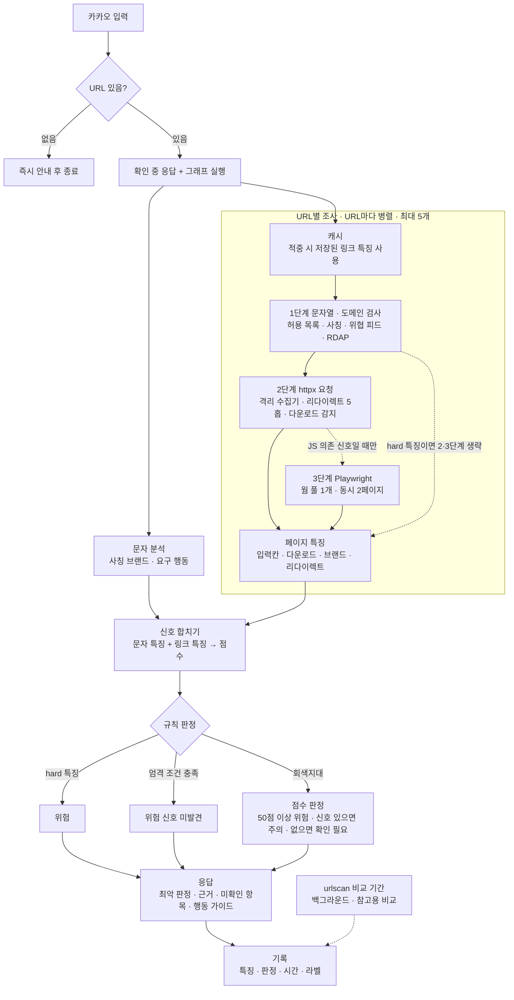

# 스미싱 확인 파이프라인 설계 (자체 URL 조사·판정, urlscan 대체)


상태: 설계 합의 완료, 구현 전. 가중치·판정 기준값·시간 목표는 비교 기간 측정으로 확정하는 초기 가설값이다.

## 목적

urlscan은 결과 조회까지 약 30초가 걸려 카카오 응답 흐름의 가장 큰 지연 요인이다. 자체 3단계 조사와 규칙·점수 판정으로 urlscan을 대체해, URL 입력부터 판정까지 p95 10초 이하로 줄인다. t3.medium(2 vCPU / 4GB RAM, 50GB 암호화 SSD) 한 대에서 돌 수 있게 가볍게 만든다.

- 판정은 위험 근거와 확인 범위를 나눠 본다. 근거가 있으면 위험·주의, 근거가 없으면 확인 범위에 따라 위험 신호 미발견·확인 필요다.
- hard 특징이 있으면 다른 단계가 실패했어도 위험이다. 공식 조회 경로이고, 모든 검사를 마쳤고, 위험 신호가 없을 때만 위험 신호 미발견이다.
- 나머지는 점수로 정한다. 점수 50 이상이면 위험, 위험 신호가 있으면 주의, 없으면 확인 필요다.
- 점수는 증거 묶음 + 평판 묶음이다. 감점은 평판 안에서만 작동해 증거를 깎지 못한다. 범위는 urlscan과 같은 −100 ~ 100이고, 기준값과 가중치(점수가 최종 판정에 반영되는 비율)는 비교 기간 테스트로 조정한다.
- 확인하지 못한 것은 안전으로 치지 않는다. 실패는 `check_failed`로 남기고, 응답에서 위험 근거와 따로 보여준다.
- 링크가 없는 문자는 확인 대상이 아니다.

## 범위

| 우선순위 | 항목 |
| --- | --- |
| Must | 페이지 방문 3단계: 1단계 문자열·도메인 검사 → 2단계 httpx 요청 → 3단계는 2단계에서 필요할 때만 Playwright |
| Must | 판정 계산(특징 추출 + 점수 + 규칙) 상한 3초, 목표 1초 미만 |
| Must | 전체 소요 p95 10초 이하 |
| Must | URL마다 독립 조사, URL별 판정 중 가장 위험한 것을 최종 판정으로 |
| Must | urlscan과 병행 비교 후 전환 기준 충족 시 교체. 전환 전에는 그림자 실행 |
| Must | 상업적 사용이 확인된 외부 데이터만 사용 |
| Won't (이번 범위 제외) | 이미지 분석 — 로고 이미지·스크린샷 기반 브랜드 판별 |
| Won't | 링크 없는 문자(전화 유도형 등) 판정 |
| Won't | 판정 모델(제브 등) 사용 |

## 1. 구조와 데이터 흐름

문자 분석과 URL별 조사를 LangGraph로 병렬 실행하고, 모인 특징으로 규칙이 먼저 판정한다. 전체 시간 ≈ max(문자 분석, URL별 조사) + 판정 계산.



점선 상자는 조건부로만 도는 단계(3단계)와 비교 기간에만 도는 urlscan이다.

| 구성 요소 | 역할 | 위치 | 입력 → 출력 |
| --- | --- | --- | --- |
| 카카오 스킬 엔드포인트 | URL 유무 확인, 확인 중 응답, 콜백 전송 (전환 후) | `main.py` | 문자 → 응답 |
| 그래프 | 문자 분석 ∥ URL별 조사(`Send`), 합치기·판정·응답 | `backend/src/server/scanner/graph.py` | 문자·URL 목록 → 전체 판정 |
| 문자 분석 | 사칭 브랜드·요구 행동 | 기존 메시지 분석 재사용 (어댑터) | 문자 → 문자 특징 |
| 1단계 URL 특징 | 문자열 파싱, 허용 목록 대조, 사칭 탐지, 위협 피드·신고(로컬 미러), RDAP. 도메인 단위 캐시 | `scanner/url_features.py` (메인 서버) | URL → URL 특징 |
| 2단계 httpx 수집 | 안드로이드 모바일 UA, 리다이렉트 직접 추적(최대 5홉), 내부 주소 차단, 다운로드 감지, HTML 128KiB | `scanner/fetch.py` (격리 수집기) | URL → 수집 결과 |
| 3단계 브라우저 | 2단계가 JS 의존 신호를 보일 때만 렌더링 | `scanner/browser.py` (격리 수집기) | URL → 렌더 결과 |
| 페이지 특징 | 수집 HTML을 특징으로 변환. `ai/src/ai/page.py`의 검사 제한 재사용 | `scanner/page_features.py` | 수집 결과 → 페이지 특징 |
| 판정 | 특징 × 가중치 → 점수, 규칙 → URL별 판정 → 최악 | `scanner/scorer.py`, `scanner/rules.py` | 특징 → 판정 |
| urlscan (비교 기간) | 기존 경로, 백그라운드 비교 | 기존 `urlscan_service.py` | URL → 점수·malicious |
| 비교 기록 | 점수·판정·특징·시간·브라우저 사용·라벨 저장, 라벨 기반 지표와 urlscan 일치율(참고) 집계 | `scanner/compare.py` | → 전환 판단 |

**원칙**

- 의심 URL에 접속하는 곳은 격리 수집기(2·3단계)뿐이다. 메인 서버는 도메인 문자열로만 조회한다.
- 판정 계산(페이지 특징 추출·점수·규칙)은 네트워크·LLM·이미지 모델을 쓰지 않는다. 3초 상한을 구조로 보장하고 같은 입력에 같은 판정을 낸다.
- 비싼 단계는 필요할 때만 돈다. hard 특징이면 2·3단계를 생략하고, 3단계는 2단계 조건을 충족할 때만 돈다.
- 교체할 부분은 한 곳에 둔다. 가중치 → 학습 모델은 `scorer.py`만, 수집 방식은 수집기 계약(`CollectedPage`)만 맞추면 된다.
- 전환 전에는 그림자 실행이다. 사용자 응답은 기존 경로를 따르고 자체 결과는 비교 기록에만 쓴다.
- 링크 없는 문자는 그래프에 들어오지 않는다.

### 3단계 페이지 방문

| 단계 | 하는 일 | 의심 호스트 접속 | 상한 |
| --- | --- | --- | --- |
| 1. 문자열·도메인 검사 | URL 파싱, 허용 목록 대조, 사칭 탐지, 위협 피드·신고 이력을 먼저 확정한 뒤 RDAP 도메인 나이 | 없음 | RDAP만 2초. 늦어도 로컬 특징은 유지 |
| 2. httpx 요청 | 리다이렉트·meta refresh 추적, `Content-Type`·확장자로 다운로드 감지, HTML 정적 검사(입력칸, 폼, 브랜드, 스크립트 속 리다이렉트 흔적) | 격리 수집기 | 3초. 넘기면 그때까지의 리다이렉트 경로 유지 |
| 3. Playwright | JS 실행 후 리다이렉트·입력칸·다운로드 관찰 | 격리 수집기 | 6초(대기열 포함). 넘기면 그때까지 본 화면·다운로드 유지 |

3단계로 넘기는 조건은 hard 특징이 없고 허용 경로가 아니며, 2단계 HTML에 JS 의존 신호가 있을 때다. JS 의존 신호는 세 가지다.

- 본문 텍스트가 거의 없고 스크립트만 있음 (JS로 내용을 그리는 페이지)
- 스크립트 안에 `location` 변경 같은 리다이렉트 흔적
- 비공식 도메인인데 403·404 응답 (클로킹 의심)

다운로드 응답, 허용 경로, 수집 실패는 3단계로 넘기지 않는다. 3단계를 건너뛴 비공식 도메인은 허용 경로가 아니라 어차피 위험 신호 미발견이 될 수 없다.

**URL당 마감:** URL마다 마감 시각을 두고 남은 시간으로 각 단계를 제한한다(그림자 실행 20초). 마감을 넘겨도 그때까지 찾은 특징으로 판정하고, 끝내지 못한 단계는 `deadline`으로 남긴다. 전환 후 응답은 근거가 있으면 10초 안에 보내고, 근거가 없어 확인 필요가 될 상황이면서 실패가 시간 때문일 때만 20초까지 기다린다(카카오 콜백 URL은 5분 동안 한 번 쓸 수 있다). 마감 후에도 조사는 백그라운드에서 끝까지 돌려 캐시에 저장하고, 응답의 "다시 확인" 버튼으로 바로 받게 한다.

### t3.medium에 맞춘 조치

| 조치 | 절감 | 정확도 영향 |
| --- | --- | --- |
| 3단계 조건부 실행 | 대부분 요청에서 브라우저 비용 0 | JS 의존 신호 일부 놓침. 비공식 도메인은 신호 미발견 불가로 상쇄 |
| 브라우저 웜 풀 1개, 동시 2페이지, 50페이지마다 재시작 | 기동 1–3초, 메모리 상한 | 동시 요청이 많으면 대기. 예산 초과 시 `check_failed` |
| 이미지·폰트·미디어 차단 | 페이지 로드 수 초, 메모리 | 로고 이미지 미확인 (Won't 항목과 일치) |
| 폼 출현 또는 1–2초 네트워크 유휴 시 수집 종료 | 광고·추적 스크립트 대기 | JS로 늦게 그리는 폼도 포착 |
| URL 단위 결과 캐시 | 반복 요청 거의 0초 | 없음 |
| 수집기 컨테이너 메모리 상한, `--disable-dev-shm-usage` | 브라우저가 터져도 메인 서버 유지 | 없음 |
| 원본 HTML·파일 미저장 (특징값만 저장), 로그 로테이션 | 디스크 50GB 안에서 유지 | 없음 |

## 2. 특징과 판정

URL마다 특징을 모아 점수를 내고, 규칙이 먼저 판정한다. 위험 근거(증거)와 확인 범위(실패 단계)는 섞지 않는다.

### 점수

```
증거  = Σ 걸린 증거 특징의 가중치   (모두 +, 감점으로 깎이지 않음)
평판  = Σ 걸린 평판 특징의 가중치   (+ / −)
score = clamp( 증거 + (증거 > 0 이면 max(평판, 0), 아니면 평판), −100, 100 )
```

- 특징 값은 찾음 / 없음 / 확인 못 함 셋 중 하나다. 확인 못 한 특징은 0점이고 그 단계는 `check_failed`에 남는다. 점수는 항상 계산된다.
- 증거가 있으면 평판 합이 0 밑으로 내려가지 않는다. 인기·오래된 도메인 감점이 앱 다운로드·입력 폼 같은 증거를 깎지 못한다.
- 가중치와 기준값은 `weights/v{N}.yaml`에 둔다. 값을 바꾸면 버전을 올리고 작업 기록에 사용 버전을 남긴다.

### 특징과 초기 가중치 (가설값)

| 묶음 | 코드 | 조건 | 가중치 | hard | 단계 |
| --- | --- | --- | --- | --- | --- |
| 증거 | `threat_feed` | 상업적 사용이 허용된 위협 피드에 최근(탐지일 90일 이내) 등재. KISA 피싱사이트 URL은 2023-12-31 1회성이라 현재 0건 | +100 | ✅ | 1 |
| 증거 | `reported_before` | 사람이 확인한 스미싱 도메인 (로컬 목록) | +50 | ✅ | 1 |
| 증거 | `lookalike_domain` | 공식 도메인이 아닌데 퓨니코드, 공식 도메인과 유사, 또는 택배사 도메인 토큰 포함. 인기 도메인은 제외하되 공용 플랫폼은 제외하지 않음 | +30 | ✅ | 1 |
| 증거 | `brand_mismatch` | 문자가 사칭하는 택배사의 공식 도메인이 아님 (최종 URL 기준) | +40 |  | 합치기 |
| 증거 | `risky_action` | 문자가 앱 설치·결제·개인정보·전화를 요구 | +30 |  | 문자 분석 |
| 증거 | `input_form` | 민감 입력칸(비밀번호·카드·주민번호·생년월일·계좌·인증번호) 1개 이상, 또는 연락처 칸(이름·전화·주소) 2종류 이상 | +40 |  | 2·3 |
| 증거 | `app_download` | APK·실행 파일 다운로드 링크 또는 자동 다운로드 | +50 |  | 2·3 |
| 증거 | `other_download` | 그 밖의 파일(PDF, ZIP 등) 다운로드 | +20 |  | 2·3 |
| 증거 | `cross_domain_form` | 폼 전송 대상이 페이지와 다른 도메인 | +25 |  | 2·3 |
| 증거 | `brand_on_page` | 페이지 본문의 택배사 이름과 도메인 불일치 | +30 |  | 2·3 |
| 증거 | `cross_domain_redirect` | 리다이렉트 중 도메인 변경 (단축 URL 경유는 제외) | +20 |  | 2·3 |
| 평판 | `new_domain` | 도메인 생성 30일 이내 (RDAP) | +40 |  | 1 |
| 평판 | `ip_or_port` | IP 직접 접속 또는 비표준 포트 | +30 |  | 1 |
| 평판 | `abused_tld` | 남용 다수 TLD 목록 | +15 |  | 1 |
| 평판 | `url_shortener` | 입력 URL이 단축 URL이고 목적지가 공식 조회 경로가 아님 | +15 |  | 1 |
| 평판 | `old_domain` | 도메인 생성 2년 이상 | −20 |  | 1 |
| 평판 | `popular_domain` | Tranco 상위 10만 (공용 플랫폼 제외) | −30 |  | 1 |
| 평판 | `unverified_domain` | 최종 도메인이 허용 목록에 없음. 확인 상태라 0점, 기록용 | 0 |  | 1 |

공용 플랫폼(`notion.site` 등)과 단축 URL은 누구나 페이지를 만들 수 있어 도메인 나이·인기도가 그 페이지의 성격을 말해주지 않는다. 그래서 `new_domain`·`old_domain`·`popular_domain`을 계산하지 않는다.

**신규 도메인:** 피싱 도메인은 등록 직후 쓰이고 금방 닫히는 경우가 많아, 위협 피드보다 먼저 잡을 수 있는 신호다. 다만 새로 연 정상 페이지도 있어 단독으로는 40점(주의)까지만 가고, 다른 신호가 하나 더 있으면 위험이 된다. 등록 후 일수를 기록에 남겨, 구간(예: 7일 이내)과 점수는 비교 기간 라벨로 정한다.

### 판정 규칙 (URL별)

위에서부터 처음 맞는 조건으로 정한다.

1. hard 특징이 하나라도 있으면 **위험**. 다른 단계가 실패했어도 마찬가지다.
2. 아래를 모두 만족하면 **위험 신호 미발견**.
   - 최종 URL이 허용 목록의 도메인 + 허용 경로이고, 경유지는 허용 경로이거나 단축 URL
   - 쿼리에 `url=`, `redirect=`, `next=` 같은 리다이렉트 파라미터 없음
   - 가중치가 +인 특징이 하나도 걸리지 않음
   - `check_failed` 없음
3. `score >= danger_threshold`(초기 50)이면 **위험**.
4. 가중치가 +인 특징이 하나라도 있으면 **주의**.
5. 나머지는 **확인 필요**. 위험 신호는 못 찾았지만 공식 주소가 아니거나 일부를 확인하지 못한 경우다.

최종 판정은 URL별 판정 중 가장 위험한 것이다 (위험 > 주의 > 확인 필요 > 위험 신호 미발견). 2번은 점수와 무관해서 감점 특징이 신호 미발견을 만들 수 없다.

| 상황 | 증거 | 평판 | 점수 | 판정 |
| --- | --- | --- | --- | --- |
| 인기 도메인에 올린 APK | 50 | −30 → 0 | 50 | 위험 |
| 신규 도메인 + 입력 폼 | 40 | 40 | 80 | 위험 |
| 해킹된 오래된 사이트 + 입력 폼 + 다른 도메인 폼 | 65 | −20 → 0 | 65 | 위험 |
| 신규 도메인만 | 0 | 40 | 40 | 주의 |
| 인기 도메인, 신호 없음 | 0 | −30 | −30 | 확인 필요 |
| CJ 사칭 문자 + 신규 도메인 + 페이지 접속 시간 초과 | 40 | 40 | 80 | 위험 |

### 허용 목록과 공식 URL 대조

공식 URL 대조는 사칭 탐지(`lookalike_domain`, `brand_mismatch`)와 신호 미발견 조건의 일부로만 쓴다. 공식 도메인이라는 사실만으로 신호 미발견이 되지 않는다. 리다이렉트와 문자의 요구 행동은 따로 본다.

- 호스트는 소문자·끝 점·포트를 정리한 뒤 등록 도메인 단위로 정확히 비교한다. 문자열 포함 검사는 쓰지 않는다 (`cjlogistics.com.evil.xyz` 차단).
- 경로는 허용 경로 접두어로 비교한다. 공식 도메인이라도 게시판·업로드·리다이렉트 기능 주소는 허용 경로가 아니다.
- 단축 URL은 최종 URL로 대조한다. 공식 조회 경로로 끝나면 단축 경유가 신호 미발견을 막지 않는다.
- 항목은 도메인, 허용 경로, 확인 출처, 확인 날짜를 모두 갖는다. 출처·날짜가 없거나 공유 도메인(`naver.me`, `bit.ly`, `notion.site` 등)이 들어가면 서버가 기동하지 않는다.
- 첫 범위는 주요 택배사 5곳의 조회 페이지 경로다. 목록 밖 도메인은 신호 미발견이 될 수 없다.
- 택배사 사이트 개편에 대비해 주기적으로 점검하고, 로그에 자주 나오는 정상 주소를 검토해 추가한다.

### 응답

판정 + 위험 근거(걸린 특징 상위 2–3개) + 확인하지 못한 것 + 행동 가이드를 보낸다. 위험 근거와 확인하지 못한 것은 섞지 않고 따로 적는다.

| 판정 | 첫 줄 | 덧붙이는 것 |
| --- | --- | --- |
| 위험 | 이 링크는 누르지 마세요 | 근거, 미확인 항목, KISA 118 |
| 주의 | 위험 신호가 있어요 | 근거, 미확인 항목, KISA 118 |
| 확인 필요 | 위험 신호는 못 찾았지만 믿을 수 있는 주소인지도 확인하지 못했어요 | "공식 주소가 아니에요" 또는 미확인 항목 (예: "이미 닫혔거나 응답이 없어요") |
| 위험 신호 미발견 | 확인한 범위에서 위험 신호를 찾지 못했어요 | 공식 조회 페이지라는 사실 |

"안전"이라는 표현은 쓰지 않는다. 행동 가이드("결제·개인정보는 링크 대신 공식 앱에서")는 모든 판정에 붙어, 공식 사이트 해킹·파밍·판정 오류처럼 검사로 막을 수 없는 남은 위험을 막는다.

### 2단계 (라벨 누적 후)

라벨된 사례가 수백 건 쌓이면 가중치를 로지스틱 회귀로 학습한다. 확률 p는 (2p − 1) × 100으로 같은 범위에 맞춘다. 입력 특징은 위 표를 그대로 써서 항목별 설명 가능성을 유지하고, 도메인 나이는 일수 그대로 넣는다.

## 3. 비교 기간 운영과 전환

비교 기간에는 자체 파이프라인을 그림자로 돌린다. 사용자 응답은 기존 경로(urlscan 기반)를 유지하고, 자체 결과는 비교 기록에만 쓴다. 전환 기준을 모두 충족하면 사용자 응답을 자체 판정으로 바꾼다.

### 작업별 기록 (BE 작업 저장소, wire 밖)

| 분류 | 항목 |
| --- | --- |
| 자체 | score(증거·평판 합 포함), 판정(4단계), 가중치 버전, 특징별 값·가중치, `check_failed` 목록, 시스템 상태(위협 피드 미설정 등), 도메인 나이(일), 브라우저 사용 여부, 브라우저가 판정을 바꿨는지 |
| urlscan | score, malicious, 조회 시각 |
| 시간 | 1단계, 수집(2·3단계), 페이지 특징, 판정 계산, 전체 |
| 판정 일치 (참고) | 자체(`score >= compare_threshold`, 초기 50) vs urlscan malicious. `check_failed`가 없고 둘 다 값이 있을 때만 |

특징값을 저장하므로 가중치를 바꾸면 재수집 없이 저장 특징으로 재계산한다. 스미싱 페이지는 수 시간 내 사라지는 경우가 많아 재수집에 의존하지 않는다.

### 불일치 처리

사람이 확인해 smishing / benign / unknown으로 라벨한다. 불일치 건만이 아니라 비교 URL로 확보한 건도 라벨한다. 라벨은 전환 판단의 기준이고, 가중치·판정 기준값 조정과 2단계 학습 자료로도 쓴다.

### 비교 URL 확보

- 스미싱: 실제 사용자 문자, 팀이 받은 스미싱 문자, 최근 공개 사례. 페이지가 금방 닫히므로 수집 당일 처리. KISA 피싱사이트 URL 공공데이터는 2023년 스냅샷이라 비교 URL로 쓰지 않는다.
- 정상: 허용 목록 택배사 URL, 목록에 없는 정상 제휴사 URL.
- 목표: 라벨된 스미싱 50건·정상 50건 이상(가설값). 비교 기간 트래픽으로 모일지는 예상 문자 수를 보고 정한다.

### 전환 기준 (모두 충족)

| 기준 | 값 |
| --- | --- |
| 스미싱 탐지율 | 스미싱 라벨 50건 이상에서 위험·주의로 판정한 비율 90% 이상 |
| 정상 오탐률 | 정상 라벨 50건 이상에서 위험으로 판정한 비율 5% 이하 |
| 판정 계산 시간 | p50 1초 미만, p95 3초 이하 |
| 전체 소요 시간 | p95 10초 이하 |
| `check_failed` 비율 | 5% 이하 |

전환 기준은 아니지만 함께 집계한다: urlscan 판정 일치율과 불일치 건 정답률(참고), 브라우저 사용 비율과 브라우저가 판정을 바꾼 비율(3단계 조건 조정), 확인 필요 비율과 시간 관련 실패 비율, 10초를 넘긴 비율과 10–20초 사이에 확인을 마친 비율(응답 연장 효과). urlscan 일치율을 전환 기준에서 뺀 이유: urlscan은 추적하는 브랜드에 대해서만 피싱·사칭 판정을 내리고, malicious 판정을 무인 차단 신호로 쓰지 말라고 안내한다(2026-10-02 확인). 국내 택배사가 추적 대상이 아니면 우리가 맞게 잡은 건이 불일치로 집계된다.

### 전환 후

사용자 응답을 자체 판정으로 바꾸고 카카오 콜백 구조(먼저 "확인 중" 응답, 결과는 콜백으로)를 적용한다. 설정 `SCAN_COMPARE`를 끄면 urlscan 호출과 비교 기록이 멈춘다. 가중치 버전을 올릴 때 다시 켜서 비교할 수 있도록 코드는 남긴다.

## 4. 오류 처리

확인하지 못한 것은 안전으로 치지 않는다. 실패한 단계는 `check_failed`에 남기고 나머지 단계는 계속 진행한다. 실패는 위험 신호 미발견만 막고, 이미 찾은 위험 근거는 그대로 판정에 쓴다. 근거가 없으면 확인 필요다.

| 상황 | 처리 | 기록 |
| --- | --- | --- |
| 링크 없는 문자 | 그래프에 들어가지 않고 즉시 안내 | — |
| RDAP 2초 초과·실패 | 로컬 특징은 유지하고 도메인 나이만 미확인. 허용 목록·공용 플랫폼·IP는 조회하지 않음 | `domain_age` |
| 위협 피드 미설정 (쓸 수 있는 출처 없음, 또는 탐지일 90일 이내 항목 0건) | URL 확인 실패가 아닌 시스템 상태로 기록 | 시스템 상태 `threat_feed` |
| 위협 피드 파일은 있는데 읽지 못함 | URL 확인 실패 | `threat_feed` |
| 문자 분석 실패 | `brand_mismatch`·`risky_action` 미확인 | `message` |
| 2단계 접속 불가·HTTP 오류 (닫힌 사이트 포함) | 1단계 특징으로 계속. 응답에 "이미 닫혔거나 응답이 없어요" | `fetch` |
| 2단계 3초 초과 | 그때까지의 리다이렉트 경로 유지 | `fetch_timeout` |
| 사설·메타데이터 주소로 리다이렉트 | 요청을 보내지 않음 | `blocked_address` |
| 리다이렉트 5홉 초과 | — | `redirect_limit` |
| HTML 128KiB 초과로 잘림 | 찾은 특징은 반영, 없음은 확정 못 함 | `html_truncated` |
| 3단계 대기열·6초 초과 | 그때까지 본 화면·다운로드 유지. 화면이 비면 2단계 HTML로 검사 | `browser_timeout` |
| 3단계 크래시 | 2단계 결과로 계속 | `browser` |
| 수집기 미연결 | — | `collect` |
| URL 6개 이상 | 앞 5개만 조사 | `url_limit` |
| URL당 마감 초과 | 모인 특징으로 판정 | `deadline` |
| 가중치·허용 목록 파일 오류 | 서버 기동 시 검증, 실패하면 기동하지 않음 | — |
| urlscan 실패 (비교 기간) | 일치율(참고) 계산에서 제외. 응답·전환 판단 영향 없음 | — |

**시간 관련 실패:** `fetch_timeout`, `browser_timeout`, `deadline`은 시간을 더 주면 풀릴 수 있다. 응답 연장(근거가 없을 때 20초까지)은 이 실패에만 적용한다. 닫힌 사이트, 차단·위장(데이터센터 IP 차단 등), .kr RDAP 미지원 같은 실패는 기다려도 풀리지 않으므로 바로 응답한다.

**캐시:** URL 단위로 판정이 아니라 링크 특징을 저장한다. 판정을 저장하면 같은 링크라도 이번 문자의 위험한 요구가 무시되기 때문이다. 위험 신호가 있던 결과(hard 또는 점수 50 이상)는 24시간, 그 밖은 3시간 보관하고 `check_failed`가 있는 결과는 저장하지 않는다.

**실패율 관리:** 실패가 잦으면 확인 필요가 쏟아져 사용자가 결과를 무시하게 된다. `check_failed` 비율을 전환 기준(5% 이하)으로 관리하고 단계별 원인을 작업 기록에 집계한다.

## 5. 보안

의심 URL에 접속하는 곳은 격리 수집기(2·3단계) 하나뿐이다. 메인 서버는 도메인 문자열로만 조회(RDAP)한다.

- **내부 주소 차단 (SSRF):** 2단계는 리다이렉트를 직접 따라가며 홉마다 호스트의 DNS 해석 결과를 검사해, 사설·루프백·링크 로컬·메타데이터(`169.254.169.254`) 주소면 요청을 보내지 않는다. 3단계는 IP 리터럴 요청을 차단하고, 수집기 컨테이너의 egress 방화벽으로 내부망을 막는다. 인스턴스는 IMDSv2만 허용한다.
- **다운로드 미실행:** 2단계는 응답 헤더와 확장자로만 판단하고 파일 본문은 읽지 않는다. 3단계의 다운로드는 감지 즉시 취소한다.
- **HTML은 데이터로만:** 수집기가 넘긴 HTML은 신뢰하지 않는다. 파싱만 하고 그 안의 URL로 접속하지 않는다. 크기·처리 시간 제한은 `page.py` 기준을 따른다.
- **외부 텍스트:** RDAP 응답은 외부 텍스트로 취급해 생성일만 파싱한다.
- **수집기 컨테이너:** root가 아닌 사용자로 실행하고 비밀키를 넣지 않는다. 메모리 상한을 걸고, 브라우저는 50페이지마다 재시작한다.
- **로그 마스킹:** 문자 원문은 이름·전화번호·주소를 가린 뒤 저장한다.
- **urlscan 제출 (비교 기간):** public 제출은 URL이 공개되므로 unlisted 또는 private로 제출한다. 스미싱 URL에 수신자 전화번호나 개인 토큰이 들어갈 수 있다.

## 6. 테스트

판정과 특징은 표 기반 단위 테스트로, 흐름은 가짜 수집기와 가짜 urlscan을 붙인 통합 테스트로 확인한다.

| 대상 | 방법 |
| --- | --- |
| 점수기 | 두 묶음 합산, 증거가 있을 때 평판 0 하한, clamp, 미확인 0점, 가중치 파일 검증(증거 양수, hard는 증거 묶음) |
| 판정 규칙 | hard → 위험(실패가 있어도), 신호 미발견 조건, 근거 없음 → 확인 필요, 4단계 최악 판정 |
| 1단계 | 파싱, 허용 경로, 리다이렉트 파라미터, 사칭(공용 플랫폼은 인기 예외 없음), RDAP mock·지연 시 로컬 hard 신호 유지, 공용 플랫폼·허용 목록 RDAP 생략, 위협 피드 미설정 vs 로드 실패, 목록 동기화의 탐지일 필터(기간 안 항목 0건이면 미설정) |
| 2단계 | `httpx.MockTransport`: 3xx 체인, 5홉 초과, meta refresh, 내부 주소 차단, APK, HTML 잘림, 시간 초과 시 경로 유지, 3단계로 넘기는 조건 |
| 3단계 | 리소스 차단·다운로드 분류, 대기열 초과·시간 초과 시 증거 유지(가짜 렌더러). 실제 브라우저 왕복은 수동 확인 |
| 페이지 특징 | 입력칸 판별(민감 칸, 연락처 2종류, 이메일 제외, 라벨 연결), APK 링크, 다른 도메인 폼, 브랜드 불일치, 단축 URL 경유 제외 |
| URL 조사 | hard면 방문 생략, 최종 도메인 재계산, 단축 URL → 공식 경로는 최종 URL로 대조, URL당 마감, 캐시 TTL |
| 그래프 | 정상 + 악성 링크 → 위험, 문자 분석 실패 → 확인 필요와 이유, 닫힌 사이트 문구, URL 6개 이상 |
| 비교 기록 | 라벨 기반 탐지율·오탐률, 일치율(참고)·정답률·실패율·브라우저·연장 지표, 전환 기준 판정(일치율만으로는 전환하지 않음) |
| 시간 상한 | 128KiB HTML로 특징 추출 + 판정 500ms 이내 |
| 통합 | 가짜 urlscan에서 `SCAN_COMPARE`가 켜져도 기존 응답이 그대로이고 그림자 결과가 기록됨. 그림자 실패도 응답에 영향 없음 |

실제 RDAP·격리 수집기·브라우저 왕복 시간은 테스트로 증명하지 않고 비교 기간 측정(§3 전환 기준)으로 확인한다.

## 7. 알려진 위험과 열린 질문

- **PRD와의 정렬:** PRD의 수렴 기록 "위험도 점수 → 조사 과정"과 달리 이 설계는 점수를 판정에 쓴다. 사용자에게는 점수 숫자 대신 걸린 특징과 확인하지 못한 것(조사 과정)으로 설명해 원칙을 유지하는 방향을 제안한다. 점수 숫자 노출 여부는 팀 결정이 필요하다.
- **위협 피드:** KISA 피싱사이트 URL(공공데이터포털)은 이용허락 제한이 없지만 2023-12-31 기준 1회성 스냅샷(27,582행)이다. 피싱 도메인은 며칠 안에 쓰이고 사라지며, 오래된 도메인은 만료·재등록될 수 있어 hard 신호로 쓰면 오탐이 된다. 그래서 탐지일 90일(가설값) 이내 항목만 위협 피드로 쓴다. 지금은 0건이라 위협 피드 미설정으로 시작하고, 알려진 피싱 사이트 대조는 사실상 없다. 실시간 피드는 상업 이용 가능 여부와 국내 스미싱 포함 여부를 확인한 뒤 추가한다.
- **.kr RDAP:** IANA의 .kr 위임 기록에는 WHOIS 서버만 있다. rdap.org로 .kr 도메인 나이를 얻지 못하면 매번 `domain_age` 실패가 나므로, .kr만 공공데이터포털 WHOIS API(KISA, 인증키 필요, .kr·.한국만 지원, 등록일자 제공)로 조회하는 보완을 둔다.
- **격리 수집기 배치:** 2·3단계 수집기를 이 저장소 코드로 격리 서버(ADR 0002)에 배포할지, 격리 서버가 같은 반환 계약을 구현할지 격리 담당자와 합의해야 한다.
- **클로킹·차단:** JS 기기 감지, 자동화 브라우저 탐지, 데이터센터·보안 업체 IP 차단은 정상 화면이나 오류를 보여줄 수 있다. 수집기가 AWS에 있어 해당될 수 있다. 안드로이드 모바일 환경으로 줄이고 행동 가이드로 완화한다.
- **3단계 조건:** JS 의존 신호 휴리스틱의 적중률은 아직 측정 전이다. 브라우저가 판정을 바꾼 비율을 보고 조정한다.
- **입력칸 판별 한계:** 클릭해야 나오는 다음 화면, 이미지로 그린 칸, 단서 없는 칸, iframe 안 폼, JS로 보내는 정보(fetch·텔레그램 봇 등)는 놓친다.
- **도메인 나이 한계:** 공용 플랫폼·무료 서브도메인은 나이를 계산하지 않고, 오래된 도메인을 사서 쓰는 경우는 못 잡는다.
- **t3.medium 자원:** 브라우저 동시 2페이지·메모리 상한은 측정 전 가설이다. 부하 테스트로 페이지당 메모리·시간을 재서 조정한다. CPU 크레딧(Unlimited 기본, 지속 사용 시 추가 과금)을 CloudWatch로 감시한다.
- **외부 데이터 (2026-10-02 확인):** Google Safe Browsing(비상업 전용)·OpenPhish Community(상업 불가)는 쓰지 않는다. Tranco 기본 목록에는 Cloudflare Radar(CC BY-NC 4.0)가 섞여 있어 비상업 출처를 뺀 사용자 정의 목록만 쓴다. KISA 공공데이터는 이용허락 제한 없음. urlscan은 일상 업무 사용은 괜찮지만, 대량 제출이나 상업 서비스 통합은 사전 협의가 필요하다.
- **남용 TLD 목록**의 출처는 구현 전에 정한다.
- **문자 분석 연결:** 기존 메시지 분석 결과에서 사칭 브랜드·요구 행동을 꺼내는 필드 매핑을 확인해야 한다.
- **urlscan 판정의 한계:** urlscan은 추적하는 브랜드에 대해서만 피싱 판정을 내리고 신규 도메인을 점수에 넣지 않는다. 그래서 전환 기준을 라벨된 표본으로 바꾸고 일치율은 참고값으로만 본다. 스미싱·정상 각 50건(가설값)이 비교 기간 트래픽으로 모일지는 예상 문자 수를 보고 정해야 한다.