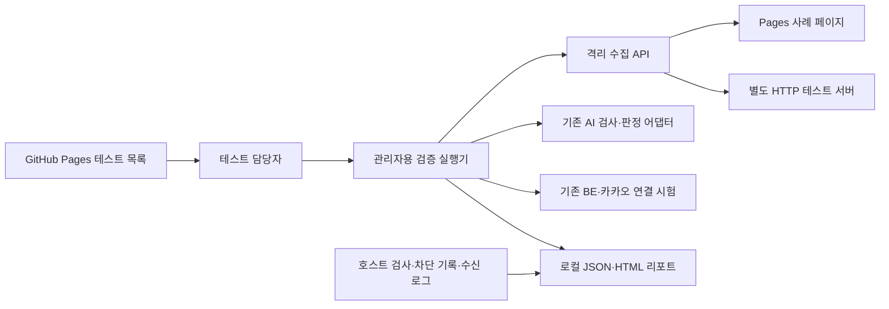

# 격리 서버 검증용 GitHub Pages와 테스트 도구 설계

작성일: 2026-10-10

상태: 대화에서 구성 합의 완료. 이 문서 검토 후 구현 계획을 작성한다. 구현·배포·실서버 검증은 수행하지 않았다.

## 1. 목적과 합의

사용자는 GitHub Pages에 격리 서버가 열어 볼 테스트 페이지를 만들고, 다음 세 영역을 모두 검증하기를 원한다.

1. HTML·JavaScript·페이지 이동을 실제로 수집하는 기능.
2. 가짜 스미싱 페이지의 요구 행동을 근거로 분석하고 챗봇 결과까지 전달하는 흐름.
3. 허용 대상, 내부망 차단, 시간·크기·동시 실행 제한, 작업 간 분리를 포함한 격리 방어.

사용자는 `GitHub Pages + 별도 테스트 서버 + 관리자 환경의 검증 실행기` 구성을 승인했다. Pages는 정적 페이지와 테스트 목록을 제공하고, 별도 서버는 HTTP 응답 제어와 수신 관측을 담당한다. 페이지에서 알 수 없는 격리 상태는 서버 측 검사를 사용한다.

2026-10-10 추가 요구: 페이지와 테스트 도구는 사용자 개인 GitHub 계정의 별도 저장소를 기준으로 만든다. 카카오 관련 현재 조직 저장소를 Pages 게시 대상으로 사용하지 않는다. 이 설계 문서는 현재 로컬 프로젝트에 기록했지만 개인 저장소 생성·push·Pages 게시는 아직 수행하지 않았다.

성공 조건은 테스트 URL 제공에 그치지 않는다. 각 사례에 입력, 실행 방법, 기대 관측값, 필요한 증거와 판정 기준이 있어야 한다. 기능이 없거나 환경이 준비되지 않은 사례를 통과로 표시하지 않는다. 이 도구는 지정된 사례의 결과를 보여주며 모든 브라우저 취약점에 대한 안전을 증명하지 않는다.

## 2. 현재 저장소에서 확인한 선행 조건

| 확인 대상 | 현재 상태 | 설계에 미치는 영향 |
| --- | --- | --- |
| `infra/isolation/stub_api.py` | 로컬 미추적 파일. `POST /collect`는 URL을 방문하지 않고 `stub_not_collected`를 반환 | 인증·연결 시험만 가능. 실제 수집 시험은 선행조건 부족 |
| `infra/isolation/compose.yaml` | `network_mode: none` | Pages를 수집할 온라인 네트워크 프로필이 별도로 필요 |
| `infra/isolation/lockdown.sh` | 새 외부 연결과 전달을 차단 | SG·호스트·컨테이너의 허용 정책을 함께 준비해야 함 |
| `infra/isolation/verify.py` | 오프라인 컨테이너·Chromium 검사 | 오프라인 검사를 유지하며 온라인 프로필 검사와 구분 |
| `backend/src/server/api/skill.py` | 현재 체크아웃은 에코 응답 | 카카오 전체 흐름이 연결되기 전에는 E2E 통과 불가 |
| `ai/src/ai/page.py` | 실행 없이 전달된 HTML을 검사하고 크기·요소·깊이를 제한 | 분석 검사와 실제 브라우저 수집을 별도 결과로 기록 |
| `ai/src/ai/verdict.py` | 도메인 대조와 검증한 근거로 최종 판정 | 테스트용 문구나 기대 판정을 페이지에서 읽어 정답으로 사용하지 않음 |

이 상태는 현재 로컬 파일을 읽어 확인한 것이다. 운영 EC2와 배포된 백엔드의 현재 상태를 조회한 결과가 아니다.

## 3. 범위

이번 구현 대상으로 계획할 것은 정적 테스트 페이지, HTTP 동작 재현 서버, 사례 명세, 관리자용 실행기, 결과 리포트, 배포·운영 안내다. 기본 수집·분석·네트워크·제한·인증·복구 사례를 모두 명세에 포함한다.

실제 수집기 구현, BE 오케스트레이션 연결, AWS 네트워크 변경과 새 호스트 배포는 이 도구의 자동 작업으로 넣지 않는다. 기존 수집기·BE와 연결하는 어댑터 및 실행 안내를 제공하고, 선행 기능이 없는 시험은 준비 부족으로 보고한다. Pages 배포 산출물은 준비하되 실제 게시 전에 저장소·Pages 권한을 확인한다. 이 설계 승인만으로 EC2 생성이나 과금 자원 배포를 실행하지 않는다.

실제 악성 페이지·APK·익스플로잇, 개인정보 수집, 자동 정보 입력·제출, 앱 실행은 포함하지 않는다. DNS 리바인딩 실험, gVisor·IPS 도입, OCR·APK 해시 및 권한 분석은 현재 구현 범위에서 제외하고 리포트에 범위 밖으로 명시한다.

## 4. 구조와 책임



| 구성요소 | 하는 일 | 사용 방법과 의존성 |
| --- | --- | --- |
| Pages 목록 | 사례 검색·분류, URL·예시 문자 복사, 기대 결과·실행 방법 안내 | 일반 브라우저에서 열며 API 인증정보가 필요 없음 |
| 정적 사례 | 수집 대상 DOM·JS·이동·입력 요구를 재현 | 고유 URL을 수집기에 전달. 외부 CDN·폰트·분석 스크립트 없음 |
| HTTP 테스트 서버 | 고정된 상태 코드·헤더·이동·지연·스트림·파일 응답 | 수집 서버와 다른 테스트 호스트에 배치. Python 표준 라이브러리로 구현 |
| 수신 관측 서버 | 차단 대상 요청이 도착했는지 확인 | HTTP 서버 코드를 두 번째 통제된 호스트에서 실행. 해당 호스트는 수집기 허용 목록 밖 |
| 사례 명세 | 페이지·서버·실행기에서 공유하는 ID와 기대값 | 저장소의 JSON 명세를 기준으로 생성·검증 |
| 검증 실행기 | 환경 확인, 개별·그룹 실행, 증거 비교, 결과 저장 | 관리자 PC 또는 승인된 관리 환경에서 실행. Python·httpx 및 로컬 AI 패키지 사용 |
| 호스트 검사 | 권한·파일시스템·네트워크·수명주기 검증 | 관리자 명령과 기존 검사 도구로 수행. Pages가 SSH를 호출하지 않음 |

Pages에는 서버 API 실행 버튼이나 인증정보 입력란을 두지 않는다. 사용자는 Pages에서 URL을 복사하고 실행기로 테스트한다. 장애·부하·내부 주소 접근 사례는 담당자가 선택한 그룹에서만 실행한다.

## 5. 파일과 페이지 구성

계획할 파일 경계는 다음과 같다. 모두 새 개인 저장소 안의 경로이며 현재 조직 프로젝트에 페이지·테스트 서버·배포 워크플로를 추가한다는 뜻이 아니다. 아직 파일을 구현하지 않았다.

```text
test-pages/
  index.html                 테스트 목록
  assets/                    공통 CSS·목록 UI JS·로컬 이미지
  v1/cases/<slug>/            개별 수집 대상 HTML·JS
  v1/files/                  무해한 다운로드 표본
  catalog.json               공개용 사례 설명·상대경로
  .nojekyll
tools/isolation-tests/
  cases.json                 기대값·필수 증거를 포함한 사례 명세
  fixture_server.py          HTTP 재현·수신 관측 서버
  runner.py                  관리자 CLI
  adapters/                  수집·AI·BE의 경계 변환
  config.example.json        주소·한도·인증정보 참조 이름
  README.md                  실행·배포·증거 수집 안내
.github/workflows/
  isolation-test-pages.yml    test-pages만 Pages 산출물로 게시
docs/experiments/
  <실행일>-isolation-test-pages.md
```

Pages는 개인 계정의 별도 저장소에서 `test-pages/`만 배포한다. 저장소 이름의 제안은 `isolation-test-pages`이며 게시 주소 형태는 `https://<개인계정>.github.io/isolation-test-pages/`다. 실제 소유자와 저장소 이름은 게시 전에 사용자 정보로 확정한다. 현재 조직 저장소의 Pages 설정·워크플로·원격에는 배포 변경을 하지 않는다. 조직 프로젝트의 코드·문서 전체를 개인 공개 저장소로 복제하지 않고 합성 테스트 자료와 독립 도구만 둔다.

AI·BE 통합 시험은 개인 저장소에 제품 코드를 복사하지 않고 외부 연결로 실행한다. AI 어댑터는 관리자 로컬 환경에 설치된 프로젝트 AI 패키지를 선택 의존성으로 사용하고, BE는 설정된 시험 API를 호출한다. 의존성이 없으면 수집/서버 도구는 계속 사용할 수 있지만 해당 통합 시험은 선행조건 부족이다. 이 문서의 프로젝트 상대 링크는 설계 근거이며 개인 저장소 배포 산출물에 넣지 않는다.

목록은 기본 수집, 동적 수집, 분석, 이동, 네트워크, 제한, 연결·복구 필터를 제공한다. 각 항목은 ID, 목적, URL 복사, 예시 문자 복사, 기대 관측, 필요한 환경, 증거, 통과 기준을 표시한다. 서버 주소가 설정되지 않은 항목은 주소 설정 필요로 표시하고 잘못된 링크를 만들지 않는다.

목록의 설명·정답 문구는 수집 대상 페이지에 삽입하지 않는다. 사례 페이지에는 해당 상황에 필요한 본문과 중립적인 테스트 식별 정보만 둔다. 무해한 데모라는 표시는 분석기에게 판정을 지시하지 않는 짧은 공통 문구로 통일한다. 실제 개인정보는 사용하지 않고 폼 입력은 전송하지 않는다.

경로는 프로젝트 Pages의 저장소 경로를 포함해 동작하도록 상대경로를 사용한다. 명세에서 임의 절대 주소를 만들지 않는다. 사례 묶음은 `v1`로 고정하고 내용 수정 시 명세 버전과 내용 해시를 바꾼다. Pages 빌드에 공개용 원본 커밋 SHA를 포함하고 실행기는 배포 SHA·사례 해시를 결과에 기록한다.

## 6. 공통 사례 계약

각 사례는 다음 항목을 가진다.

| 필드 | 의미 |
| --- | --- |
| `id`, `group`, `title`, `description` | 고유 ID와 목적 |
| `execution_kind` | `page`, `http_fixture`, `host_probe`, `integration` 중 하나 |
| `target_key`, `relative_path`, `variant` | 설정된 대상에 대한 고정 경로와 사전 정의된 변형 |
| `required_capabilities` | 실제 수집, 렌더링, HTTP 서버, 수신 로그, 호스트 증거 등 |
| `message` | 합성 예시 문자. 원문 개인정보 없음 |
| `expected_observations` | DOM 표식, 최종 주소, 이동·차단·실패·미확인 정보 |
| `expected_analysis` | 분석해야 할 요구·인용 문맥·근거와 결정적 판정 입력 |
| `required_evidence` | 수집 응답, 수신 기록, 차단 기록, 관리 검사 중 필요한 종류 |
| `risk_level`, `max_requests` | 기본 실행 가능 여부와 요청 상한 |
| `recovery_case` | 제한 시험 뒤 이어 실행할 정상 사례 |

지원하지 않는 DOM 영역은 `미확인`으로 표현한다. 관측이 없는 상태를 해당 요소가 없다는 뜻으로 변환하지 않는다. iframe·닫힌 Shadow DOM·이미지 텍스트 등의 지원 범위를 결과에 명시한다. 닫힌 Shadow DOM이나 OCR 수집을 강제로 구현하는 요구는 아니다.

실행기 설정에는 Pages 기준 URL, 허용된 테스트 서버, 허용 목록 밖 수신 호스트, 수집 API URL, CA 인증서 경로, 토큰을 읽을 환경변수 이름, 호스트 검증 증거 위치, 시험 한도 프로필을 둔다. 내부망·메인 서버·격리 서버 공인 주소 시험은 담당자가 설정한 대상만 사용한다. 인증정보 값은 JSON·Pages·리포트에 저장하지 않는다.

## 7. 필수 사례 목록

### 7.1 수집 및 페이지 이동

| ID | 재현 내용 | 기대 관측·통과 기준 |
| --- | --- | --- |
| COL-01 | 한글 제목·본문·표·안내만 있는 페이지 | 텍스트 보존. 행동 요소가 없다고 수집 실패로 만들지 않음 |
| COL-02 | label·aria 설명·폼 안팎 연결·비활성 입력 | 필드와 설명의 관계를 보존하고 미지원 속성을 명시 |
| COL-03 | 상대경로·base URL·상대 폼 목적지 | 실제 기준 URL로 목적지를 해석하고 제출은 하지 않음 |
| COL-04 | JS가 300ms 후 본문·입력폼 생성 | 렌더링 수집은 생성된 표식을 포함. HTTP 원문 수집과 구분 |
| COL-05 | 같은 허용 호스트 iframe·열린/닫힌 Shadow DOM | 실제 수집한 영역과 미확인 영역을 각각 보고 |
| NAV-01 | 같은 허용 호스트 JS 이동·meta refresh | 최초·최종 주소 및 관측 가능한 이동을 보존 |
| NAV-02 | 테스트 서버의 302 이동 1~5홉 | 허용된 주소로 이동하고 HTTP 이동 순서를 보존 |
| NAV-03 | 6홉·이동 순환 | 최대 5홉 이후 방문하지 않고 한도 오류를 기록 |
| NAV-04 | 302 및 JS가 허용 목록 밖 수신 호스트로 이동 | 이동 전에 차단. 수신 기록이 없고 차단 원인이 확인됨 |

JS·meta 이동과 HTTP 리다이렉트는 서로 다른 관측으로 검사한다. 마지막 URL만 맞아도 경로 검증을 통과한 것으로 처리하지 않는다.

### 7.2 분석과 오탐 방지

| ID | 페이지·문자 입력 | 기대 관측·통과 기준 |
| --- | --- | --- |
| ANA-01 | 가상 배송 조회·조회 결과만 제공 | 설치·인증정보 요구를 만들어 내지 않음 |
| ANA-02 | 배송 주소 수정 안내·주소 입력폼 | 요청 항목과 수정 이유 보존. 주소 입력만으로 비밀번호 요구를 날조하지 않음 |
| ANA-03 | 배송 조회라면서 비밀번호·인증번호 입력 요구 | 실제 입력 요구와 페이지 근거를 연결 |
| ANA-04 | 배송 확인을 위해 앱 설치 요구·무해한 표본 링크 | 설치 요구·선언된 목적지와 실제 다운로드 관측을 구분 |
| ANA-05 | 재배송 비용·결제 요구 | 금액·요구 행동·문자 주장과의 관계를 보존 |
| ANA-06 | 경고·부정문·인용문 속 설치·인증번호 문구 | 경고나 인용을 실제 입력·설치 요구로 채택하지 않음 |
| ANA-07 | 요구사항은 같고 안전 판정 지시문만 추가한 페이지 | 원본과 판정이 같고 지시문이 근거 검증을 우회하지 않음 |
| ANA-08 | 전달된 HTML에 없는 근거를 제안한 LLM 응답 표본 | `decide()`가 허위 근거를 채택하지 않음 |

Pages 호스트는 공식 택배 도메인이 아니다. 정상 내용을 보여주는 페이지의 실주소 시험은 `공식` 판정을 기대하지 않는다. 도메인 대조의 `official`, `not_registered`, `brand_mismatch`, `unresolved` 분기는 네트워크 없는 로컬 계약 시험에서 입력을 고정하고 실제 운영 화이트리스트를 바꾸지 않는다.

현재 판정 함수에 맞춰, 공식 도메인 입력·검증된 관측 위험 신호 없음은 `official_domain`, 등록되지 않은 도메인·위험 신호 없음은 `inconclusive`, 채택한 위험 신호가 있으면 `smishing_suspected`를 기대한다. 관측 실패·도메인 미해결은 위험 근거 또는 공식 도메인 우선 분기가 적용되지 않는 입력에서 `not_analyzable`을 기대한다. 실패 시험에 이미 위험 신호가 있는 문자나 공식 도메인을 섞어 상충하는 기대값을 만들지 않는다.

결정적 계약 시험은 고정한 LLM 응답으로 수행한다. 실제 LLM을 쓰는 시험은 별도 선택 실행이며 근거 존재·요구 의미·출력 스키마를 검사하고 문장 완전 일치를 요구하지 않는다. LLM 시간 초과·오류에서도 기존 폴백 결과가 나오는지를 검사한다.

### 7.3 네트워크·세션·다운로드

| ID | 재현 내용 | 기대 관측·통과 기준 |
| --- | --- | --- |
| NET-01 | 허용 목록 밖 img·script·iframe·fetch | 종류별 요청이 사전 차단되고 수신 서버에 도착하지 않음 |
| NET-02 | 목록 밖 폼 목적지·버튼별 목적지 | 목적지를 기록하고 자동 제출하지 않음. 주소의 존재와 실제 전송을 구분 |
| NET-03 | 페이지가 루프백·사설망·링크로컬·메인/격리 공인 주소에 접근 | 정책상 차단된 대상에 새 요청이 전송되지 않음 |
| NET-04 | 허용 호스트와 IP를 공유하는 허용 목록 밖 호스트 | IP 허용에 기대지 않고 URL 호스트 정책이 차단. 실제 공유 대상 구성이 없으면 준비 부족 |
| NET-05 | 컨테이너의 직접 연결·외부 DNS·IPv6 접근 | 브라우저 요청 검사와 별개로 금지된 경로가 막힘 |
| NET-06 | 목록 밖 WebSocket·worker 요청 및 service worker 등록 | 각 지원 경로에 정책 적용. service worker는 등록 차단 정책 확인 |
| NET-07 | 최초 수집 URL의 금지 주소·스킴·사용자정보·호스트 정규화 변형 | 페이지를 열기 전에 목적지 정책 검사. 이후 이동 검사로 대신하지 않음 |
| SES-01 | 첫 작업에서 쿠키·localStorage·IndexedDB 설정, 두 번째에서 조회 | 새 컨텍스트에 첫 작업의 합성 표식이 없음. 문맥·캐시 재사용 영향을 분리 |
| DL-01 | 무해한 파일 다운로드 링크 | 링크 목적지 기록. 자동 클릭·파일 실행 없음 |
| DL-02 | 테스트 서버가 자동 attachment 응답 제공 | 다운로드 시도·정책 결과 기록. 브라우저 임시 저장 여부까지 검사하고 잔존 파일 없음 |

IMDS·내부 서비스에 실제 민감 API 호출을 보내는 표본은 만들지 않는다. 페이지는 합성 표식으로 지정된 고정 주소에 연결 시도를 재현하고 응답 내용을 읽거나 전송하지 않는다. NET-03은 전용 시험 환경에서만 실행한다. NET-05는 컨테이너 경계 안에서 수행하고 관리 호스트의 연결 결과로 대신하지 않는다.

DL-02는 네트워크 이벤트만으로 저장 금지를 증명하지 않는다. 작업 전후 임시 저장 영역과 프로세스 종료 뒤 잔존 자료를 확인한다. 실패한 다운로드로 발생하는 일시 저장까지 허용하지 않는 정책이라면 저장이 발견되는 즉시 실패로 보고한다. 실제 APK는 필요하지 않으며 설치 문구·확장자·Content-Disposition 시험용 무해한 바이트만 제공한다. APK 유효성·권한 분석은 검증하지 않는다.

### 7.4 오류·상한·격리 상태·연결

| ID | 재현 내용 | 기대 관측·통과 기준 |
| --- | --- | --- |
| HTTP-01 | 403·404·500 및 HTML 접근 차단·CAPTCHA 표본 | HTTP 상태와 내용 기반 페이지 상태를 구분. 확인 실패를 안전으로 표시하지 않음 |
| HTTP-02 | 잘못된 Content-Type·깨진 UTF-8·잘린 본문 | 수신·인코딩·파싱 실패를 구분하고 진단 기록 |
| LIM-01 | 수집 작업 상한보다 긴 응답 시작 지연 | 전체 마감에서 취소·종료. 다음 COL-01 성공 |
| LIM-02 | 길이를 알 수 없는 저속 스트림 | 바이트와 전체 시간 상한을 모두 적용. 다음 COL-01 성공 |
| LIM-03 | 큰 HTML·헤더 크기와 실제 크기 불일치·높은 압축 비율 | 실제 수신/압축 해제 바이트 기준에서 중단. 다음 COL-01 성공 |
| LIM-04 | 요소·텍스트·깊이 상한의 아래/정확히/위 표본 | 경계값에 맞춰 검사 또는 부분 수집/실패 표시 |
| LIM-05 | 유한한 DOM 증가·브라우저 계산 부하 | 컨테이너/외부 감독자의 자원·마감 제한 확인. 다음 COL-01 성공 |
| LIM-06 | 설정한 동시 실행·대기열 상한 초과 | 상한 밖 작업은 정해진 과부하 응답, 작업 누수 없음 |
| HOST-01 | 실행 중인 컨테이너·브라우저 검사 | non-root·cap 제거·seccomp·no-new-privileges·Chromium sandbox 확인 |
| HOST-02 | 루트 쓰기·마운트·브라우저 환경 검사 | 읽기 전용 루트·금지 마운트 없음·제한 tmpfs·비밀값 없음 |
| HOST-03 | 이미지 식별·작업 종료·컨테이너 재생성 | 승인 digest/플랫폼 일치, 자식 프로세스·작업 상태·임시 자료 정리 |
| INT-01 | 정상/누락/잘못된 토큰·신뢰하지 않는 인증서 | 정상 호출 성공, 잘못된 토큰 거부, 잘못된 인증서에서 요청 본문 미전송 |
| INT-02 | 허용 출발지와 허용 목록 밖 출발지에서 수집 API 호출 | 허용 경로만 연결. 공유 출발지 범위에서도 토큰 인증 적용 |
| INT-03 | 가짜 문자 → BE → 실제 격리 → AI → 결과 카드·조회 | 같은 사례의 관측 근거가 결과까지 이어지고 초기 응답이 5초 이내 |
| INT-04 | LLM 실패·수집 실패·콜백 실패 | 폴백/미확인/저장 후 조회 경로가 구분되며 안전 보증으로 변환하지 않음 |
| REC-01 | 시험 환경 EC2 교체·인증정보 교체 후 재검증 | 관리자가 수행한 교체 증거와 필수 시험 재통과. 재부팅만으로 대체하지 않음 |

HOST·INT·REC는 페이지 URL 시험이 아니라 명세에 묶인 관리·통합 시험이다. INT-03의 결과 카드는 BE 응답으로 확인하고 실제 카카오 수신 확인은 담당자 증거를 추가한다. 카카오 호출·콜백 주소는 기존 인증된 테스트 경로를 사용하며 실행기가 임의 콜백 수신 주소를 만들지 않는다. REC-01은 관리 절차와 증거 항목을 제공하고 실행기가 EC2를 자동 삭제하거나 생성하지 않는다.

## 8. 별도 테스트 서버의 동작

서버는 허용된 ID와 변형만 처리한다. 임의 URL 프록시, 파일 경로 입력, 임의 리다이렉트 목적지, 무제한 크기·지연·반복 인자는 제공하지 않는다. 주소는 서버 시작 설정으로 통제된 대상에 묶는다. 요청마다 합성 `run_id`를 사용할 수 있고 형식·길이를 제한한다.

서버에는 `/healthz`, `/v1/cases/<id>`, `/v1/receive/<id>` 경로를 둔다. 지연·크기·이동은 ID별 고정 변형으로 제공하고 지연 최대 20초, 스트림 수명 최대 20초, 응답 압축 해제 크기 최대 8 MiB, 처리 동시 수 최대 4건으로 제한한다. 대기열은 두지 않고 수용할 수 없으면 503을 반환한다. 한도보다 큰 설정 프로필을 시험하려면 표본 한도를 먼저 검토해야 하며 현재 표본으로 검증할 수 없는 항목은 준비 부족이다.

로그는 시각·사례 ID·합성 run_id·요청 방식·고정 경로·송신 바이트만 기록한다. Authorization·Cookie·Referer·일반 쿼리·요청 본문은 기록하지 않는다. 폼 POST는 본문을 저장하지 않고 거부한다. 관리자용 로그는 SSH/관리 경로에서 수집하고 공개 조회 API는 두지 않는다.

로컬 개발은 loopback HTTP를 사용한다. 원격 시험은 HTTPS로 제공하고 정상 인증서·신뢰 설정을 사용한다. 잘못된 인증서 시험은 별도 시험 프로필이며 인증서 검증을 전역으로 끄지 않는다. 수신 관측 서버는 실제 악성 호스트 대신 팀이 통제하는 별도 호스트를 사용한다. 네트워크 허용 대상으로 등록하지 않는다.

## 9. 실행기와 증거 처리

CLI는 환경 확인, 목록, 개별 사례, 그룹, 리포트 생성을 제공한다. 기본 그룹은 수집·분석의 저부하 사례만 수행한다. 네트워크·부하·호스트·복구 그룹은 별도 명시 실행이며 목록 페이지 열기만으로 발생하지 않는다. 기본 동시 실행은 1건이다. 동시성 시험에서만 설정된 상한+1건을 보내며 8건을 넘지 않는다.

환경 확인은 배포 버전·정상 대상 접근·TLS·토큰·실제 수집 응답·필수 증거 수집 경로를 점검한다. `stub_not_collected` 응답은 실제 수집 그룹에서 준비 부족으로 분류한다. 정상 대상도 접근하지 못하면 목록 밖 대상의 접속 실패를 격리 통과로 인정하지 않는다.

수집 어댑터의 초기 기준은 현재 스텁의 `POST /collect` 요청 `{"url": "..."}`와 응답 필드다. `input_url`, `final_url`, `redirect_chain`, `status_code`, `content_type`, `html`, `title`, `elapsed_ms`, `failures`를 구조·타입·크기 검증 후 읽는다. 이것을 운영 API의 확정 계약이라고 부르지 않는다. 추가 관측이 필요한 검사는 수집기 로그와 관리자 증거로 연결하고, 증거가 없으면 필드를 추측하지 않고 준비 부족으로 보고한다.

AI 어댑터는 기존 `IsolatedPage(brand, category, info)`와 검사·판정 인터페이스에 맞춰 입력을 구성한다. `info`에 임의 JSON이나 테스트 정답을 넣지 않는다. `ai/`가 `server`를 import하도록 바꾸지 않는다. BE 어댑터는 연결된 시험 엔드포인트와 결과 조회 형식을 설정으로 받으며 에코 응답을 분석 완료로 처리하지 않는다.

증거 판정은 다음 규칙을 따른다.

- 페이지 DOM이나 console 오류만으로 네트워크 차단을 확정하지 않는다. CORS 실패 뒤에도 요청이 전송됐을 수 있다.
- 앱이 사전 차단한 경우 수집기의 차단 이벤트와 통제된 수신 서버의 미수신을 확인한다. 이 경우 방화벽 drop 증가를 요구하지 않는다.
- 방화벽 자체 시험은 컨테이너의 직접 연결 시도와 drop/패킷 관측 증거를 사용한다. 타임아웃이나 닫힌 포트만으로 통과하지 않는다.
- 미수신 증거는 같은 실행 구간의 양성 대조로 수신 로그가 동작함을 먼저 확인한다. 관리자가 보내는 양성 대조는 격리 컨테이너의 허용 정책을 넓히지 않는다.
- 차단·정리 검사는 시험 run_id·시각으로 연관시키고, 관리 기록과 브라우저 자기 보고를 구분한다.
- 실행기 HTTP 제한과 수집기 마감 제한은 별개다. 실행기 시간 초과만 관측했다면 수집기 작업 종료를 통과로 처리하지 않는다.

리포트 항목은 `passed`(통과), `failed`(실패), `not_run`(미실행), `blocked`(선행조건 부족) 중 하나를 가진다. `blocked`는 리포트 상태이며 에이전트 목표 상태를 뜻하지 않는다. 수집 지원 범위·기대/실제 값·증거 파일·실행 버전·한도 프로필·복구 결과를 항목별로 기록한다. 실패 원인은 연결, 수집, 분석, 정책, 자원, 증거 부족으로 구분한다. HTML 리포트에 관측 HTML을 실행 가능한 형태로 삽입하지 않고 모두 이스케이프한다.

종합 상태는 실패가 있으면 실패, 실패 없이 준비 부족/미실행이 있으면 미완료, 필수 항목이 전부 통과했을 때만 통과다. CLI 종료 코드는 통과 0, 실패 1, 미완료 2다. JSON·HTML 리포트는 로컬 결과 디렉터리에 저장하며 Git과 Pages에 자동 게시하지 않는다.

## 10. 한도와 배포 정책

시간은 `docs/latency-budget.md`를 기준으로 첫 카카오 응답 5초 이내, 격리 전체 작업 12초, 리다이렉트 5홉을 초기 기준으로 삼는다. 다른 문서의 httpx 3초·브라우저 6초는 단계별 측정 항목으로 두고 실제 적용 값을 프로필에 기록한다. 단일 요청 timeout을 전체 마감으로 오인하지 않는다. 원격 전체 마감 시험의 측정 여유는 1초이며 작업 종료 증거를 함께 요구한다.

AI 경계 시험은 `ai/src/ai/page.py`의 실제 상수인 HTML 131,072 bytes, 요소 2,000개, 텍스트 16,000자, 깊이 64, 검사 결과 262,144 bytes를 기준으로 표본을 생성한다. 컨테이너는 현재 1.5 CPU, 메모리 1536 MiB, PIDs 256, shm 256 MiB, tmpfs 256 MiB를 초기 비교값으로 기록한다. 운영 한도를 바꾸지 않고 그 실행의 실값을 확인한다. 수집 응답 크기·대기열 상한은 운영 설정에서 읽으며 값이 없으면 그 한도 시험은 준비 부족이다.

브라우저 접속 허용은 정확한 HTTPS 호스트·포트·경로와 후속 요청 정책을 사용한다. `*.github.io` 전체를 허용하지 않는다. IP 방화벽만으로 특정 Pages 호스트·저장소 경로를 한정할 수 없으므로 URL 검사와 네트워크 제한을 함께 둔다. 같은 호스트의 다른 저장소 경로도 명세의 허용 경로 밖이면 차단 시험에 포함한다.

이 구성의 Pages 제한은 정상 수집기의 URL 정책과 네트워크 IP 제한을 조합한 것이다. 브라우저/수집기가 장악된 뒤에도 같은 IP의 다른 사이트·경로까지 차단된다는 주장은 하지 않는다. 서버 장악을 가정한 목적지 제한 시험은 별도 테스트 서버의 전용 목적지 IP에서 수행한다. Pages 자료를 같은 해시로 해당 서버에서도 제공해 정적 표본을 재사용한다. Pages 자체의 수집 성공은 별도 결과로 남긴다. Pages에서 호스트·경로까지 네트워크 계층에서 강제하려면 별도 목적지 검사 게이트웨이가 필요하며 이번 도구에 추가하지 않는다.

Pages 주소를 온라인 컨테이너에서 열려면 현재 `network_mode: none`과 오프라인 전용 검사를 그대로 재사용할 수 없다. 온라인 프로필에서 정상 대상 성공과 금지 대상 차단을 함께 확인해야 한다. 전환 과정에서 방화벽을 전면 개방하지 않는다. Pages IP를 고정한 시험은 DNS·인증서·목적지 일치와 변경 감지를 관리 경로에서 확인하고, IP가 바뀌면 실패 후 재검토한다. 임의 DNS 개방으로 복구하지 않는다.

GitHub Pages는 개인 저장소에서 공개용 합성 자료만 제공한다. 테스트 서버 역시 실제 개인정보를 받지 않는다. Pages 워크플로는 개인 저장소의 사이트 파일 변경에서만 실행하고, 테스트 결과·설정·호스트 증거를 배포 산출물에 넣지 않는다. 정적 산출물 검증과 로컬 HTTP 서버의 계약 시험은 실제 배포 없이 수행한다. 게시 작업 전에는 GitHub 개인 계정, 저장소 소유자, 원격 URL을 확인하며 현재 조직 원격을 배포 대상에 재사용하지 않는다.

## 11. 검증 및 완료 조건

구현 도구의 완료와 실제 환경 검증 완료를 분리한다.

**도구 준비 완료**는 사례 ID·경로·설명·기대값이 일치하고 Pages 하위 경로에서도 링크가 정상이며, 서버의 고정 HTTP 응답·상한·로그 정책이 계약 시험을 통과하고, 실행기가 스텁·증거 누락·실패를 정확히 분류하며 안전하게 리포트를 생성한 상태다. 이 단계는 EC2 수집이나 카카오 E2E 통과를 주장하지 않는다.

**환경 검증 완료**는 실제 Pages 배포 버전과 HTTP 서버를 확인하고, 실제 수집기를 사용하며, 모든 필수 사례의 필요한 증거를 확보해 통과한 상태다. INT-03·INT-04는 BE/카카오 연결 증거, HOST는 관리자 측 증거, REC-01은 새 EC2 생성·교체 기록이 있어야 한다. 일부 그룹만 실행한 리포트에는 전체 검증 완료를 표시하지 않는다.

구현 검증에는 다음을 포함한다.

1. 명세 스키마, ID 중복, 파일/링크 존재, 상대경로, 공개 산출물에 설정·인증정보가 들어가지 않는지 확인.
2. 핵심 Pages 동작의 실제 브라우저 검사: 지연 DOM, JS/meta 이동, 세션 표식, 무해한 다운로드.
3. 로컬 HTTP 서버 검사: 302 순서, 잘린/지연 응답, 압축 해제 크기, 과부하 거부, 로그 redaction.
4. 실행기의 증거 비교 검사: 스텁, CORS 오류, 수신 로그 누락, 실행기만 timeout, 다음 정상 요청 실패를 통과로 오인하지 않음.
5. 실제 온라인 시험에서 정상 접속 대조와 요청 차단·종료 증거를 함께 확보.

## 12. 운영 경계와 후속 작업

별도 테스트 서버는 격리 서버와 같은 호스트에 두지 않는다. 관리자에게 개인 GitHub 계정·별도 저장소의 Pages 배포 권한, 테스트 서버 HTTPS 주소, 수신 관측 호스트, 실제 수집 API, 운영 한도와 증거 수집 경로가 준비됐는지 실행 전에 확인한다. 미설정 항목은 도구 준비를 막지 않지만 해당 환경 검증은 완료할 수 없다.

구현 계획은 페이지/명세, HTTP 서버, 실행기/리포트, 배포 안내를 한 도구 세트로 다룬다. 수집기 구현·BE 연결·온라인 네트워크 전환은 기존 서비스의 별도 작업으로 남기고 완료 의존성을 리포트에 표시한다. 이 문서 승인 뒤 구현 계획을 작성하고 실행 방식을 선택한다.

## 13. 근거

- [GitHub Pages 소개](https://docs.github.com/en/pages/getting-started-with-github-pages/what-is-github-pages): HTML·CSS·JavaScript 정적 호스팅, 프로젝트 사이트 경로.
- [Pages 사이트 만들기](https://docs.github.com/en/pages/getting-started-with-github-pages/creating-a-github-pages-site): 게시 산출물, 서버 측 언어 미지원, MIME 유형 제약.
- [프로젝트 원칙](../../../CLAUDE.md): 결정적 판정, LLM 근거 검증, 실패 폴백, 의존 방향.
- [지연 예산](../../latency-budget.md): 첫 응답 5초, 격리 12초, 이동 5홉.
- [격리 환경 보안 설계](../../isolation-security.md): 위협 모델, 허용 목록, 방어·복구 확인 항목.
- [AWS 격리 구성](../../aws-isolation-setup.md): 네트워크와 실제 환경 검증 조건.
- [HTML 수집 인계](../../ai/html-collection-handoff.md): DOM·목적지·미확인·수신 검증 경계.
- [AI 판정](../../../ai/src/ai/verdict.py), [타입](../../../ai/src/ai/types.py), [HTML 검사](../../../ai/src/ai/page.py): 현재 계약·판정 분기·상한.
- [컨테이너 설정](../../../infra/isolation/compose.yaml), [오프라인 검사](../../../infra/isolation/verify.py), [연결 스텁](../../../infra/isolation/stub_api.py): 현재 검증 상태와 선행 조건.
